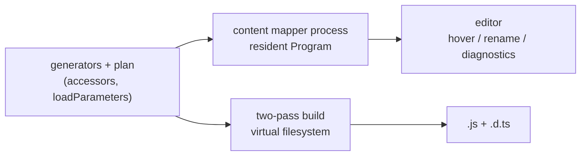

# TypeScript 7.1: Why We Chose Content Mappers

**Decision:** Webda's compile-time code generation moves to a **TypeScript 7.1 content mapper**
for type-checking and editor support, plus a **two-pass virtual-filesystem build** for
JavaScript emit. Model and service sources adopt a `.model.ts` / `.service.ts` suffix.

This page records why, what was measured, and what we are knowingly accepting.

---

## 1. The problem

Webda generates code at compile time. The clearest example is property coercion:

```ts
export class User extends Model {
  createdAt: Date;
}
```

You are allowed to write `user.createdAt = "2020-01-01"` — the value is coerced on the way
in. Today that works through a `ts-patch`-installed emit transformer which synthesises:

```js
get createdAt() { return this[WEBDA_STORAGE]["createdAt"]; }
set createdAt(value) { this[WEBDA_STORAGE]["createdAt"] = value != null ? new Date(value) : value; }
```

and a matching `.d.ts` through an `afterDeclarations` transformer, with `@webda/ts-plugin`
suppressing the false `TS2322` the editor would otherwise report.

**TypeScript 7 — the native Go port — removes every one of those hooks.** Verified against
the shipped binary:

- no `createProgram` / `factory` / `transform` exported from `typescript`
- zero `TransformerFactory` / `CustomTransformer` anywhere in the distribution
- `emit()` takes no transformers parameter
- the `tsgo` binary contains no plugin-loading machinery at all — a
  `"plugins": [{ "name": "@webda/ts-plugin" }]` entry is silently ignored

`ts-patch` and language-service plugins are not temporarily unavailable. They are gone, and
the 7.1 API additions make clear the direction is _analyse → generate source → emit_.

## 2. The insight that makes any of this possible

The `.d.ts` the current transformer produces is an **asymmetric accessor**:

```ts
get createdAt(): Date;
set createdAt(value: string | number | Date);
```

Asymmetric accessors have been legal TypeScript _source_ since 4.3. So the entire apparatus
exists to synthesise, at emit time, something you are simply allowed to write down.

Write it in the source and:

- any compiler (tsc, tsgo, esbuild, swc) emits the correct `.js` and `.d.ts`
- the false `TS2322` disappears, because the setter genuinely accepts the wide type
- the language-service plugin and `ts-patch` both become unnecessary

Every option below is a different answer to _when_ and _where_ that text gets written.

## 3. Options considered

|                                               | Authored source              | Build               | Editor                   | Verdict                          |
| --------------------------------------------- | ---------------------------- | ------------------- | ------------------------ | -------------------------------- |
| **A.** Wrapper + hand-rolled LSP proxy        | clean                        | temp-dir wrapper    | LSP proxy we own forever | rejected — unbounded maintenance |
| **B.** In-place codegen, committed            | contains generated accessors | plain `tsc`         | correct natively         | rejected — see §7                |
| **C.** Narrow the API so coercion is explicit | clean                        | plain `tsc`         | correct natively         | rejected — breaking API change   |
| **D.** Content mapper + two-pass build        | clean                        | two-pass virtual FS | correct natively         | **chosen**                       |

## 4. What a content mapper is

Content mappers landed in TypeScript 7.1 (`microsoft/typescript-go#4712`, completed in
`microsoft/TypeScript#63936`). They are the supported successor to language-service plugins
for source-generating tools, and they are wired into `tsc`, the project system,
`.tsbuildinfo` **and the language server**.

A mapper is a separate process speaking JSON-RPC over stdio. TypeScript drives every
exchange — `initialize` → `openProject` → `transform`* → `closeProject`. Mappers never
initiate.

Registration is a tsconfig option plus a package manifest:

```jsonc
// tsconfig.json
{
  "contentMappers": [
    {
      "package": "@webda/content-mapper",
      "extensions": [".model.ts", ".service.ts"],
      "options": { "storageModule": "@webda/models" }
    }
  ]
}
```

```jsonc
// @webda/content-mapper/package.json
{
  "typescript": {
    "contentMapper": {
      "exec": ["node", "dist/server.js"],
      "compilerOptions": ["module", "target"]
    }
  }
}
```

`transform` returns the rewritten text plus a **span map** — tuples of
`[virtualStart, virtualLength, originalStart, originalLength, kind, features?]` — where
`kind` is `Verbatim`, `Atom` or `Alias`, and `features` is a bitmask enabling individual
language-server features per span. Untouched regions map verbatim, which is what keeps
diagnostics, hover and rename landing on the authored text.

Content mappers are trust-gated: `tsc --runExternalCode` on the command line, and
`initializationOptions.runExternalCode` over LSP. Note it is **not** an LSP command-line
flag — `tsc --lsp --runExternalCode` fails with `flag provided but not defined`.

## 5. Constraints we verified

These were established empirically against `typescript@7.1.0-dev.20260918.1`, not inferred
from documentation.

### A mapper cannot claim `.ts`

```
error TS100021: Content mapper file extension '.ts' is a built-in extension
and cannot be registered by a content mapper.
```

Content mappers exist to bring _foreign_ file types into a program — `.vue`, `.svelte`,
`.astro`. On the face of it the feature does not apply to Webda at all.

### But compound suffixes are accepted

`.model.ts`, `.webda.ts` and `.wts` all pass validation. Only a missing leading dot is
rejected (`model.ts` → `TS100020`). `.model.ts` was then verified end to end: the mapper is
invoked, the transform applied, diagnostics mapped back, and the file imported with an
ordinary `nodenext` specifier (`./user.model.js`).

This is the finding the whole decision rests on. Because the filename still _ends_ in `.ts`,
eslint, prettier, vitest, bundlers and editor syntax highlighting keep treating it as
TypeScript. No tooling outside the compiler needs to know.

### `.model.ts` degrades gracefully; `.wts` does not

With mappers disabled, the two behave very differently:

|             | mappers on  | mappers off                      |
| ----------- | ----------- | -------------------------------- |
| `.model.ts` | transformed | **compiles as plain TypeScript** |
| `.wts`      | transformed | `TS2307: Cannot find module`     |

This is why we chose a compound suffix over a novel extension. Any tool that is not
mapper-aware — including the mapper's _own_ resident program, see §6 — still sees valid
TypeScript.

### Mappers emit declarations, not JavaScript

For a mapped input, `tsc` emits only a declaration file, and currently with a mangled name:

```
lib/user.d.model.ts.ts     # content correct, filename is not
```

This is by design — in the Vue model, a bundler compiles the component and TypeScript only
type-checks and emits types. The filename is a known defect
(`microsoft/TypeScript#64053`, fix in flight as `#64120`).

**Webda needs `tsc` to produce runtime JavaScript, so content mappers cannot be our build
path.** That is why the decision includes a two-pass build.

## 6. The architecture

The two halves share one implementation of the transform. The generators and the plan model
(`Edit` = `[start, end) -> text`) are the stable core; the mapper and the build are thin
hosts around it.



### The resident program

`transform(fileName, content)` hands the mapper one file's text and nothing else — no
`Program`, no `Checker`. That is not enough for Webda: the dominant coercions
(`ManyToOne<T>` → `ModelLink`, `OneToMany<T>` → `ModelRelated`, `@WebdaAutoSetter`
set-methods) all require type resolution. Measured in this repo, there are roughly **4**
plain `Date` fields against **~100** relation ones, so a purely syntactic mapper would cover
the rare case and miss the common one.

So the mapper runs its own TypeScript program over the original sources and keeps it warm
across requests. Unsaved editor buffers reach it through a filesystem layer.

Because `.model.ts` degrades to plain TypeScript, the mapper opens the project's own
tsconfig _without_ `runExternalCode`: mappers are inert in its resident program, so
recursion is impossible.

### Two implementation traps

Both cost real debugging time, and the second is dangerous:

- **`APIOptions.fs` cannot carry the unsaved buffer.** Source files are cached, so the
  spawn-time `readFile` callback is consulted once and a later edit to the same path is
  never re-read. Use `createFileSystemLayer` passed to `snapshot.update`, which is checked
  ahead of the host filesystem.
- **`ensurePrograms: true` is required.** Programs update lazily, so without it the new
  snapshot hands back the _previous_ program and every transform silently analyses stale
  text — producing plausible, wrong output with no error anywhere. This is the easiest way
  to build something that appears to work and does not.

## 7. Why not in-place codegen

Option B — run the generator and commit its output — is simpler in almost every operational
respect: no mapper process, no trust prompts, no span maps, no second resident program.

It was rejected for one reason: **forgetting to run the generator is not a compile error.**

An un-generated model is perfectly valid TypeScript. The wide-assignment path would still be
caught, but that is not where the damage is — hydration is. `Object.assign(model, json)`
passes through `any`, so a missing coercion leaves a string in a `Date`-typed field and
nothing complains until something calls `.getTime()` in production.

The usual mitigation is a CI check (`webdac code && git diff --exit-code`). It works, but it
fires in CI rather than at the compiler, and the local loop is wrong until then.

Two further costs:

- every semantic change drags generated churn into the diff, degrading review quality
- committing accessors changes the generated metadata — measured below

### Measured: in-place codegen changes `webda.module.json`

Today the module generator runs on the **untransformed** program (`compiler.ts:217` runs
after `program.emit()`, and transformers do not mutate the Program's AST), so
`@webda/schema` sees plain properties. If the accessors are committed into the source, it
sees accessors instead.

This was tested rather than assumed. Method: take `sample-app`, confirm
`webdac build --force` reproduces the committed `webda.module.json` byte for byte, apply the
**shipping** in-place morpher (`packages/compiler/src/morpher/accessors.ts`) to
`Project.test: Date`, rebuild, and diff.

It is not neutral. Two distinct effects:

**1. `Reflection` loses the field entirely.** Four models lose their entry:

```diff
- "Reflection": { "test": { "type": "Date" }, ... }
+ "Reflection": { ... }
```

Accessors are simply not recorded as fields. Anything introspecting model metadata stops
seeing `test`. This is an unambiguous regression.

**2. Input schemas widen to the setter type.** Four model `Schemas.Input` entries plus one
action input schema embedding a `Project`:

```diff
  "test": {
-   "type": "string",
-   "format": "date-time"
+   "anyOf": [
+     { "type": "string" },
+     { "type": "number" },
+     { "type": "string", "format": "date-time" }
+   ]
  }
```

This one is arguably _more_ correct — the setter genuinely accepts `string | number | Date`,
so the input schema now matches runtime behaviour. But it is still a silent, repo-wide change
to API validation and to anything generated from these schemas.

`Schemas.Stored` and `Schemas.Output` were unaffected, so there is no stored-data integrity
issue.

Net: option B requires fixing `@webda/schema` to treat an accessor pair as a field (reading
the getter for `Stored`/`Output` and the setter for `Input`) before it could ship. Option D
avoids the question entirely, because the authored source keeps plain properties and the
module generator sees exactly what it sees today.

Reproduce: `packages/compiler/src/morpher/accessors.ts` exports `transformAccessors`; drive
it over a ts-morph `Project` built from `sample-app/tsconfig.json`, then `webdac build
--force`. Note `webdac code` will not do this for you — it constructs `new Project(undefined)`
(`morpher/morpher.ts:60`), so it walks zero source files and silently does nothing.

### Mode D has the same failure class — but it is containable

If someone creates `user.ts` instead of `user.model.ts`, the mapper never runs and the same
silent bug appears. What changes is frequency and detectability:

|                             | in-place codegen              | content mapper              |
| --------------------------- | ----------------------------- | --------------------------- |
| when it can happen          | **every edit**                | only when creating a file   |
| what the guard must do      | re-run the generator and diff | check a filename            |
| missing `--runExternalCode` | n/a                           | **hard error** (`TS100024`) |

## 8. Guardrails

The naming rule must be enforced, or mode D inherits the problem it was chosen to avoid.

**Build time (authoritative).** `ModuleGenerator.searchForWebdaObjects()`
(`packages/compiler/src/module.ts:447-604`) already holds a `Program` + `TypeChecker`,
iterates every source file, and resolves each class's base-type chain across package
boundaries. A model is decided at `module.ts:540` via
`extends(classTree, "@webda/models", "Model")` — with `sourceFile.fileName` in scope. The
check is a few lines at the point that already classifies the class, using the same type
resolution the generator uses. No heuristics, no new pass.

It is also the cheapest thing in the codebase to port to TS7: it is already a standalone
post-emit pass, not a transformer.

**Load time (backstop).** `webda.module.json` records real paths — `Import:
"lib/models/project:AnotherSubProject"` — and the loader consumes them verbatim
(`application.ts:631-654`). Today only `$schema` is validated
(`unpackedapplication.ts:411`). A model whose `Import` does not match the convention can be
rejected there.

Two things to design around: `packages/core/src/test/objects.ts:508-517` rewrites
`lib/`→`src/` and `:`→`.ts:` so tests load sources, so the check must accept both forms; and
modules are also consumed at build time (`compiler/src/shell.ts:49-62`,
`core/src/bin/cli.ts:432`), so a check in `application.ts` alone is not exhaustive.

## 9. Benchmarks

### Method

|               |                                                                                                                                                                           |
| ------------- | ------------------------------------------------------------------------------------------------------------------------------------------------------------------------- |
| hardware / OS | Apple Silicon (arm64), macOS                                                                                                                                              |
| Node          | v22.19.0                                                                                                                                                                  |
| TypeScript    | `7.1.0-dev.20260918.1` (`tsgo`)                                                                                                                                           |
| fixture       | 100 generated models, 165 files total                                                                                                                                     |
| model shape   | 2 `Date` fields, 2 `ModelLink` (one via `ManyToOne` alias), 2 `ModelRelated` (one via `OneToMany`), 1 static, 1 pre-existing accessor, 1 service needing `loadParameters` |

Every model exercises all three coercion kinds and references a class from another file, so
the checker resolves something on every transform. Wall-clock figures are the median of five
runs.

> The fixture is synthetic and self-contained, with a trivial dependency graph. Absolute
> numbers on real packages will be larger; §9.4 gives the real-package figures.

### 9.1 Full build

|                                          | wall clock | diagnostics |
| ---------------------------------------- | ---------: | ----------- |
| plain `tsgo`, no mapper                  |  **0.03s** | 0           |
| `tsgo --runExternalCode` with the mapper |  **0.32s** | **0**       |

Breakdown of the difference: Node process spawn ≈ 60ms, mapper resident program startup
32ms, 100 transforms 192ms (p50 1.80ms, p95 2.70ms, max 8.10ms).

The ratio looks alarming and the absolute number does not. Bare `tsgo` at 30ms is doing no
code generation whatsoever; the meaningful comparison is §9.4.

### 9.2 Editor latency

Real LSP session, typing `deletedAt: Date;` one character at a time into a model file:

|                                       |                                        |
| ------------------------------------- | -------------------------------------: |
| cold open → first diagnostics         |                                  347ms |
| `didChange` → diagnostics, end to end |               p50 **5.1ms**, p95 8.5ms |
| mapper-internal transform             | p50 3.3ms (snapshot 2.1 + analyze 1.3) |
| diagnostics on the valid final text   |                                      0 |
| hover on the just-typed field         | `(accessor) Entity042.deletedAt: Date` |

That last row is the system working end to end: a property typed milliseconds earlier,
resolved through the checker, rewritten into an accessor, and reported back against the
authored text.

### 9.3 Scaling

Only the edited file is re-analysed, so cost tracks program refresh rather than edit size.

| models | files | resident startup | keystroke transform |
| -----: | ----: | ---------------: | ------------------: |
|     25 |    90 |             30ms |               2.5ms |
|    100 |   165 |             37ms |               3.4ms |
|    400 |   465 |             43ms |               2.9ms |
|    800 |   865 |             76ms |               5.7ms |

### 9.4 Against the current toolchain

Two-pass build over the real packages, **0 diagnostics against the generated code**:

| package | pass 1 | pass 2 |     total | edits                             |
| ------- | -----: | -----: | --------: | --------------------------------- |
| models  |   49ms |   78ms |     127ms | 0                                 |
| core    |   85ms |  207ms | **292ms** | 2 accessors + 17 `loadParameters` |
| runtime |   45ms |   73ms |     119ms | 0                                 |

TypeScript 6.0.2 single-pass `--noEmit` on `packages/core`, for comparison: **1.44s**
(median of 3).

So the replacement architecture type-checks `@webda/core` roughly **5× faster than the
toolchain it replaces**, while doing strictly more work.

### 9.5 Idempotency

A file already containing generated accessors passes through unchanged:

```
authored source   -> edits=8
generated source  -> edits=0   IDEMPOTENT
third pass        -> edits=0   stable=true
```

This matters beyond tidiness: it means a codegen'd file is a no-op through the mapper, so a
migration can proceed package by package without a flag day.

### Reproducing

```sh
cd prototypes/ts7-codegen
npm install && npm run build

cd contentmapper/bench
node generate.mjs 100                      # resize the fixture
node session-probe.mjs                     # startup + transform, no LSP
node idem-probe.mjs                        # idempotency
WEBDA_MAPPER_LOG=/tmp/m.log node typing-bench.mjs   # editor latency
../node_modules/@typescript/typescript-darwin-arm64/lib/tsc \
  -p tsconfig.json --runExternalCode       # full build
```

`prototypes/ts7-codegen/README.md` carries the full engineering log, including the
approaches that failed.

## 10. What we are accepting

Stated plainly, because none of these are solved:

- **TypeScript 7.1 is a development build.** Content mappers are three weeks old and
  actively churning, with open issues on auto-imports, inlay hints and declaration
  extensions. We are early adopters. This is the risk that cannot be engineered around.
- **Memory is unmeasured**, and two full TypeScript programs are resident — `tsgo`'s and the
  mapper's. Expect roughly double.
- **Span quality is uneven across transforms.** Accessors and `loadParameters` are local and
  structure-preserving, so their spans are clean. The WebdaQL rewrite and `unserialize`
  restructure code; their spans degrade to `Atom` or gaps, so hover and rename will be worse
  in those regions. Those transforms will be second-class in the editor and should be
  documented as such.
- **Trust prompts** for every contributor, and `--runExternalCode` in CI.
- **`snapshot` refresh already dominates `analyze`** (2.1ms vs 1.3ms), so keystroke cost
  scales with project size rather than edit size. That is the term to watch as the monorepo
  grows.
- Unmeasured: many files open and edited simultaneously, invalidation storms from editing a
  shared file, and mapper memory growth over a long session.

## 11. Target package layout

`@webda/ts-plugin` is today two things under one name: the language-service plugin, **and**
the transform library `@webda/compiler` consumes. Only the first half disappears outright —
`packages/compiler/package.json` currently declares `"@webda/ts-plugin": "workspace:^"` and
`compiler.ts:17-20` imports `DEFAULT_COERCIONS`, `PerfTracker` and the accessor transformers
from `@webda/ts-plugin/transform`.

### Where the code ends up

```
@webda/content-mapper    thin: generators + plan + spans + mapper server
        ▲                the only thing spawned per project
        │
@webda/compiler          webdac: two-pass build, webda.module.json,
                         schema, operations — reuses the same generators
```

The mapper is deliberately **not** folded into `@webda/compiler`. It is spawned as a process
per project and its startup sits on the build's critical path — roughly 60ms of the 320ms
build in §9.1 is Node spawn plus module load. `@webda/compiler` pulls `ts-morph`,
`@webda/schema`, `tsquery`, `yargs`, `diff` and `accept-language`, and `transform` needs none
of them.

Deployment detail: tsconfig names the mapper by package (`"package": "@webda/content-mapper"`),
so it must resolve from the **application**, not merely transitively through the compiler. It
belongs in the app template's `devDependencies`.

### Fate of `@webda/ts-plugin`

| file                                     | lines | fate                                                    |
| ---------------------------------------- | ----: | ------------------------------------------------------- |
| `index.ts` — language-service plugin     |   413 | delete — made unnecessary by real accessors             |
| `transform.ts` — transformer wiring      |   331 | delete                                                  |
| `transforms/accessors.ts`                |  1324 | delete once the mapper generators land                  |
| `transforms/module-generator.ts`         |   513 | delete — scaffold duplicate of `compiler/src/module.ts` |
| `analyzer.ts` — `computeCoercibleFields` |   258 | delete — replaced by the TS7 analyzer                   |
| `transforms/behaviors.ts`                |   959 | **port**                                                |
| `transforms/qlvalidator.ts`              |   598 | **port**                                                |
| `coercions.ts`                           |    29 | move into `@webda/content-mapper`                       |
| `perf.ts`                                |   122 | move into `@webda/compiler`                             |

Roughly 2.8k lines are deleted and 1.6k must be ported first.

> `qlvalidator` is the one to be careful with. It is the WebdaQL compile-time validator, a
> user-facing feature rather than error suppression. Removing `@webda/ts-plugin` before it is
> ported is a straight regression. `behaviors` is rated low difficulty because the technique
> carries over, not because it is small.

### The constraint that dictates the order

A package can declare only one `typescript`. That makes the switch to 7.1 **atomic across a
group of packages**, not incremental within them:

- `@webda/compiler` drives emit with transformers —
  `tsProgram.emit(undefined, writer, undefined, false, { before, afterDeclarations })`
  (`compiler.ts:150-168`) — plus `ts.createProgram`, `ts.factory` and `ts.createSourceFile`.
  None of these exist in TypeScript 7.
- `@webda/compiler` and `@webda/schema` are coupled at the type level: `module.ts:1354`
  passes `this.compiler.tsProgram` into `new SchemaGenerator({ program })`, typed `ts.Program`
  at `schema/src/generator.ts:211`. The signature names `ts.Program`, so the two cannot be
  typed against different majors.

  The coupling is weaker than it looks, though, and an earlier version of this page
  overstated it. The passed program is **discarded**:

  ```ts
  // generator.ts:261-266
  options.project ??= options.program ? options.program.getCurrentDirectory() : process.cwd();
  if (options.project) {
    // always true after the line above
    this.program = this.createLanguageService(this.options.project!).getProgram()!;
  } else {
    this.program = options.program!; // dead
  }
  ```

  Measured: passing a 367-file program for `packages/models` returns a **170-file program for
  `packages/schema`** — whatever project sits at the process cwd — after 371ms of rebuilding.
  In production it works by accident, because `webdac build` runs with cwd at the application
  root. But the program is built twice per build, and schemas are generated from a different
  view of the code than the one that was type-checked. This needs fixing, and the order
  matters — see below.

- `@webda/schema` builds its own language service (`generator.ts:602`,
  `ts.createLanguageService` + `ts.createDocumentRegistry`). This too was overstated here
  earlier as a redesign. It appears exactly once, at `generator.ts:263`, and only to call
  `.getProgram()` — it is a Program factory with extra steps, replaceable by
  `api.createSnapshot({ openProjects: [tsconfig] }).getProjects()[0].program`. The real work
  in porting `@webda/schema` is its 2,400 lines of type-to-JSON-Schema conversion, which lean
  on `objectFlags`, `elementFlags` and `intrinsicName`.

So the atomic unit is **compiler + schema + tsc-esm, with ts-plugin deleted in the same
change** — roughly 9,200 non-spec lines of surface. Most of it is mechanical: `ts.Node`,
`ts.ClassDeclaration` and friends map onto `typescript/unstable/ast`, the `ts.isX` predicates
onto `typescript/unstable/ast/is`, and `SyntaxKind` / `TypeFlags` / `SymbolFlags` /
`ObjectFlags` are exported from `typescript/unstable/sync`. The genuinely hard spots are the
five removed APIs listed above.

An earlier version of this section put "point `@webda/compiler` at the content mapper" as step
two. That is not reachable: the moment compiler imports `@webda/content-mapper` it inherits
the `>=7.1.0-dev` peer while still needing TypeScript 6 for its own transformers.

### Order of work

Each stage is verifiable on its own, which matters because the atomic switch at the end is
otherwise a big-bang with no feedback until it lands.

1. **Done.** Create `@webda/content-mapper` — accessors and `loadParameters` generators, plan
   model, span builder, mapper server, coercion registry.
2. **Done.** Rename sources to `.model.ts` / `.service.ts`.
3. **Done.** Naming guardrail in `ModuleGenerator.searchForWebdaObjects()` (§8).
4. Port `transforms/behaviors.ts` into a content-mapper generator. It is written against
   `ts.factory`; the target is text generation through the existing plan model.
   _Verified by:_ unit tests, plus parity against the emitted output of the current transform.
5. Port `transforms/qlvalidator.ts`. The validation half is pure analysis; the rewrite half
   (template literal to `escape()` call) is local and mechanical.
6. Port module generation to the TypeScript 7 API. Already a standalone post-emit pass, so it
   carries the least structural risk.
   _Verified by:_ **byte-diffing `webda.module.json`** against the TypeScript 6 output across
   real packages. It is a committed artefact, so an identical diff is objective proof.
7. Port `@webda/schema`, replacing `createLanguageService` with `project.languageService`.
   _Verified by:_ byte-diffing generated schemas. Note §7 — it must also learn to treat an
   accessor pair as a field if in-place output is ever produced.
8. Replace `@webda/tsc-esm` with native `rewriteRelativeImportExtensions`, or 7.1
   `transpileModule`. Used by `sample-app` and `packages/postgres`.
9. **Atomic switch:** move compiler, schema and tsc-esm to 7.1; delete `@webda/ts-plugin` and
   `ts-patch`.

### `@webda/schema` and the native generator

`@webda/schema` is a reimplementation of
[`vega/ts-json-schema-generator`](https://github.com/vega/ts-json-schema-generator) — its test
suite replays that project's fixture corpus from `packages/schema/test/vega-fixtures`, with a
blacklist for the cases it does not yet match.

Vega now ships
[`ts-json-schema-generator-go`](https://github.com/vega/ts-json-schema-generator-go): the same
generator implemented in Go on `typescript-go`, distributed as a single binary with no Node
dependency, verified against 251 golden fixtures plus the full vega-lite and Mosaic schemas.
It installs as `ts-json-schema-generator@native` and exposes `generateSchema(config)` over a
process boundary — the same shape as `packages/schema/src/worker.ts`.

If it worked on Webda's sources it would remove the entire port: TypeScript 7 everywhere, no
TypeScript 6, no hand-written conversion. **It does not, yet.** Measured against
`3.0.0-native.5`:

| target                          | result                                                          |
| ------------------------------- | --------------------------------------------------------------- |
| `packages/models` → `UuidModel` | `Error: unknown node kind=KindThisType (model.model.ts:67:32)`  |
| `sample-app` → `Company`        | `Error: Unhandled case in Node.Text: *ast.ComputedPropertyName` |

Both are central to how Webda models are written, not edge cases:

- `[WEBDA_EVENTS]?: ModelEvents<this>` — `this` types appear in `Store`, `Service`,
  `IService`, `MemoryStore` and `OperationsTransport` as well.
- `[WEBDA_PRIMARY_KEY]`, `[WEBDA_STORAGE]`, `[WEBDA_EVENTS]` — symbol-keyed slots are the
  mechanism the whole accessor design rests on.

It is also fast: 85ms for a run that costs `@webda/schema` 371ms just to build its program.

So the sequence is: report both gaps upstream, and until they close, either carry the
hand-written port or keep `@webda/schema` behind the worker boundary. Two further things to
check before committing either way — whether the native generator can express the
Webda-specific layer (`$webda` provenance markers, the `dto-in` / `dto-out` / `output` modes,
`WebdaModel` and `class` flags, Buffer mapping), and how many of the vega fixtures
`@webda/schema` currently blacklists, since those are cases where the two already disagree.

### Transition option: run the new pipeline out-of-process

Stages 4 to 8 leave `@webda/content-mapper` unused, which means no feedback until stage 9.
That can be avoided: the TypeScript 7 API already works by spawning `tsgo` as a subprocess, so
`webdac build` can shell out to a build binary in `@webda/content-mapper` rather than
importing it. No shared `typescript`, so both majors coexist, and the new pipeline can be
exercised on real packages — behind a flag — long before the switch.

Verified working: `runTwoPass({ emit: true })` emits 16 files for the package fixture with
zero diagnostics, and the generated accessors are present in the emitted JavaScript.

### Cleanup that is easy to forget

- **Comment-only references** to `@webda/ts-plugin` in four packages — they do not break the
  build, they just go stale: `core/src/application/application.ts:100,744`,
  `models/src/types.ts:284`, `ql/src/webdaql-string.ts:3`,
  `serialize/src/builtin/object.ts:89`.
- **Three tsconfigs** declare the plugin: `packages/core`, `packages/models`,
  `sample-apps/blog-system`.
- **`.vscode/settings.json`** sets `js/ts.tsdk.path` to `node_modules/typescript/lib` to load
  the plugin today. It must point at the tsgo tsdk instead — same mechanism, different target.
- **`webdac code` is currently a no-op**: `WebdaMorpher` builds `new Project(undefined)`
  (`morpher/morpher.ts:60`), so it walks zero source files. Either fix or remove it; leaving
  a command that silently does nothing is worse than either.

## References

- `microsoft/typescript-go#4712` — content mapper design and protocol
- `microsoft/TypeScript#63936` — protocol revisions
- `microsoft/TypeScript#63703` — TypeScript 7.1 iteration plan
- `microsoft/TypeScript#64053` / `#64120` — declaration extension naming
- `microsoft/TypeScript#64182` — proposal to let mappers return declarations
- `prototypes/ts7-codegen/` — working prototype, benchmarks and engineering log
