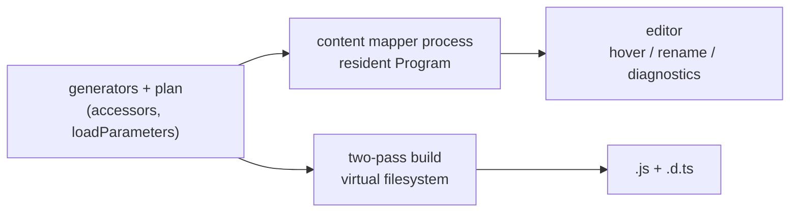

# TypeScript 7.1: Why We Chose Content Mappers

**Decision:** Webda's compile-time code generation moves to a **TypeScript 7.1 content mapper**
for type-checking and editor support, plus a **two-pass virtual-filesystem build** for
JavaScript emit. Model and service sources adopt a `.model.ts` / `.service.ts` suffix.

This page records why, what was measured, and what we are knowingly accepting.

---

## 1. The problem

Webda generates code at compile time. The clearest example is property coercion:

```ts
export class User extends Model {
  createdAt: Date;
}
```

You are allowed to write `user.createdAt = "2020-01-01"` — the value is coerced on the way
in. Today that works through a `ts-patch`-installed emit transformer which synthesises:

```js
get createdAt() { return this[WEBDA_STORAGE]["createdAt"]; }
set createdAt(value) { this[WEBDA_STORAGE]["createdAt"] = value != null ? new Date(value) : value; }
```

and a matching `.d.ts` through an `afterDeclarations` transformer, with `@webda/ts-plugin`
suppressing the false `TS2322` the editor would otherwise report.

**TypeScript 7 — the native Go port — removes every one of those hooks.** Verified against
the shipped binary:

- no `createProgram` / `factory` / `transform` exported from `typescript`
- zero `TransformerFactory` / `CustomTransformer` anywhere in the distribution
- `emit()` takes no transformers parameter
- the `tsgo` binary contains no plugin-loading machinery at all — a
  `"plugins": [{ "name": "@webda/ts-plugin" }]` entry is silently ignored

`ts-patch` and language-service plugins are not temporarily unavailable. They are gone, and
the 7.1 API additions make clear the direction is _analyse → generate source → emit_.

## 2. The insight that makes any of this possible

The `.d.ts` the current transformer produces is an **asymmetric accessor**:

```ts
get createdAt(): Date;
set createdAt(value: string | number | Date);
```

Asymmetric accessors have been legal TypeScript _source_ since 4.3. So the entire apparatus
exists to synthesise, at emit time, something you are simply allowed to write down.

Write it in the source and:

- any compiler (tsc, tsgo, esbuild, swc) emits the correct `.js` and `.d.ts`
- the false `TS2322` disappears, because the setter genuinely accepts the wide type
- the language-service plugin and `ts-patch` both become unnecessary

Every option below is a different answer to _when_ and _where_ that text gets written.

## 3. Options considered

|                                               | Authored source              | Build               | Editor                   | Verdict                          |
| --------------------------------------------- | ---------------------------- | ------------------- | ------------------------ | -------------------------------- |
| **A.** Wrapper + hand-rolled LSP proxy        | clean                        | temp-dir wrapper    | LSP proxy we own forever | rejected — unbounded maintenance |
| **B.** In-place codegen, committed            | contains generated accessors | plain `tsc`         | correct natively         | rejected — see §7                |
| **C.** Narrow the API so coercion is explicit | clean                        | plain `tsc`         | correct natively         | rejected — breaking API change   |
| **D.** Content mapper + two-pass build        | clean                        | two-pass virtual FS | correct natively         | **chosen**                       |

## 4. What a content mapper is

Content mappers landed in TypeScript 7.1 (`microsoft/typescript-go#4712`, completed in
`microsoft/TypeScript#63936`). They are the supported successor to language-service plugins
for source-generating tools, and they are wired into `tsc`, the project system,
`.tsbuildinfo` **and the language server**.

A mapper is a separate process speaking JSON-RPC over stdio. TypeScript drives every
exchange — `initialize` → `openProject` → `transform`* → `closeProject`. Mappers never
initiate.

Registration is a tsconfig option plus a package manifest:

```jsonc
// tsconfig.json
{
  "contentMappers": [
    {
      "package": "@webda/content-mapper",
      "extensions": [".model.ts", ".service.ts"],
      "options": { "storageModule": "@webda/models" }
    }
  ]
}
```

```jsonc
// @webda/content-mapper/package.json
{
  "typescript": {
    "contentMapper": {
      "exec": ["node", "dist/server.js"],
      "compilerOptions": ["module", "target"]
    }
  }
}
```

`transform` returns the rewritten text plus a **span map** — tuples of
`[virtualStart, virtualLength, originalStart, originalLength, kind, features?]` — where
`kind` is `Verbatim`, `Atom` or `Alias`, and `features` is a bitmask enabling individual
language-server features per span. Untouched regions map verbatim, which is what keeps
diagnostics, hover and rename landing on the authored text.

Content mappers are trust-gated: `tsc --runExternalCode` on the command line, and
`initializationOptions.runExternalCode` over LSP. Note it is **not** an LSP command-line
flag — `tsc --lsp --runExternalCode` fails with `flag provided but not defined`.

## 5. Constraints we verified

These were established empirically against `typescript@7.1.0-dev.20260918.1`, not inferred
from documentation.

### A mapper cannot claim `.ts`

```
error TS100021: Content mapper file extension '.ts' is a built-in extension
and cannot be registered by a content mapper.
```

Content mappers exist to bring _foreign_ file types into a program — `.vue`, `.svelte`,
`.astro`. On the face of it the feature does not apply to Webda at all.

### But compound suffixes are accepted

`.model.ts`, `.webda.ts` and `.wts` all pass validation. Only a missing leading dot is
rejected (`model.ts` → `TS100020`). `.model.ts` was then verified end to end: the mapper is
invoked, the transform applied, diagnostics mapped back, and the file imported with an
ordinary `nodenext` specifier (`./user.model.js`).

This is the finding the whole decision rests on. Because the filename still _ends_ in `.ts`,
eslint, prettier, vitest, bundlers and editor syntax highlighting keep treating it as
TypeScript. No tooling outside the compiler needs to know.

### `.model.ts` degrades gracefully; `.wts` does not

With mappers disabled, the two behave very differently:

|             | mappers on  | mappers off                      |
| ----------- | ----------- | -------------------------------- |
| `.model.ts` | transformed | **compiles as plain TypeScript** |
| `.wts`      | transformed | `TS2307: Cannot find module`     |

This is why we chose a compound suffix over a novel extension. Any tool that is not
mapper-aware — including the mapper's _own_ resident program, see §6 — still sees valid
TypeScript.

### Mappers emit declarations, not JavaScript

For a mapped input, `tsc` emits only a declaration file, and currently with a mangled name:

```
lib/user.d.model.ts.ts     # content correct, filename is not
```

This is by design — in the Vue model, a bundler compiles the component and TypeScript only
type-checks and emits types. The filename is a known defect
(`microsoft/TypeScript#64053`, fix in flight as `#64120`).

**Webda needs `tsc` to produce runtime JavaScript, so content mappers cannot be our build
path.** That is why the decision includes a two-pass build.

## 6. The architecture

The two halves share one implementation of the transform. The generators and the plan model
(`Edit` = `[start, end) -> text`) are the stable core; the mapper and the build are thin
hosts around it.


```mermaid
flowchart LR
  G["generators + plan<br/>(accessors, loadParameters)"]
  M["content mapper process<br/>resident Program"]
  B["two-pass build<br/>virtual filesystem"]
  E["editor<br/>hover / rename / diagnostics"]
  J[".js + .d.ts"]
  G --> M --> E
  G --> B --> J
```

### The resident program

`transform(fileName, content)` hands the mapper one file's text and nothing else — no
`Program`, no `Checker`. That is not enough for Webda: the dominant coercions
(`ManyToOne<T>` → `ModelLink`, `OneToMany<T>` → `ModelRelated`, `@WebdaAutoSetter`
set-methods) all require type resolution. Measured in this repo, there are roughly **4**
plain `Date` fields against **~100** relation ones, so a purely syntactic mapper would cover
the rare case and miss the common one.

So the mapper runs its own TypeScript program over the original sources and keeps it warm
across requests. Unsaved editor buffers reach it through a filesystem layer.

Because `.model.ts` degrades to plain TypeScript, the mapper opens the project's own
tsconfig _without_ `runExternalCode`: mappers are inert in its resident program, so
recursion is impossible.

### Two implementation traps

Both cost real debugging time, and the second is dangerous:

- **`APIOptions.fs` cannot carry the unsaved buffer.** Source files are cached, so the
  spawn-time `readFile` callback is consulted once and a later edit to the same path is
  never re-read. Use `createFileSystemLayer` passed to `snapshot.update`, which is checked
  ahead of the host filesystem.
- **`ensurePrograms: true` is required.** Programs update lazily, so without it the new
  snapshot hands back the _previous_ program and every transform silently analyses stale
  text — producing plausible, wrong output with no error anywhere. This is the easiest way
  to build something that appears to work and does not.

## 7. Why not in-place codegen

Option B — run the generator and commit its output — is simpler in almost every operational
respect: no mapper process, no trust prompts, no span maps, no second resident program.

It was rejected for one reason: **forgetting to run the generator is not a compile error.**

An un-generated model is perfectly valid TypeScript. The wide-assignment path would still be
caught, but that is not where the damage is — hydration is. `Object.assign(model, json)`
passes through `any`, so a missing coercion leaves a string in a `Date`-typed field and
nothing complains until something calls `.getTime()` in production.

The usual mitigation is a CI check (`webdac code && git diff --exit-code`). It works, but it
fires in CI rather than at the compiler, and the local loop is wrong until then.

Two further costs:

- every semantic change drags generated churn into the diff, degrading review quality
- committing accessors changes the generated metadata — measured below

### Measured: in-place codegen changes `webda.module.json`

Today the module generator runs on the **untransformed** program (`compiler.ts:217` runs
after `program.emit()`, and transformers do not mutate the Program's AST), so
`@webda/schema` sees plain properties. If the accessors are committed into the source, it
sees accessors instead.

This was tested rather than assumed. Method: take `sample-app`, confirm
`webdac build --force` reproduces the committed `webda.module.json` byte for byte, apply the
**shipping** in-place morpher (`packages/compiler/src/morpher/accessors.ts`) to
`Project.test: Date`, rebuild, and diff.

It is not neutral. Two distinct effects:

**1. `Reflection` loses the field entirely.** Four models lose their entry:

```diff
- "Reflection": { "test": { "type": "Date" }, ... }
+ "Reflection": { ... }
```

Accessors are simply not recorded as fields. Anything introspecting model metadata stops
seeing `test`. This is an unambiguous regression.

**2. Input schemas widen to the setter type.** Four model `Schemas.Input` entries plus one
action input schema embedding a `Project`:

```diff
  "test": {
-   "type": "string",
-   "format": "date-time"
+   "anyOf": [
+     { "type": "string" },
+     { "type": "number" },
+     { "type": "string", "format": "date-time" }
+   ]
  }
```

This one is arguably _more_ correct — the setter genuinely accepts `string | number | Date`,
so the input schema now matches runtime behaviour. But it is still a silent, repo-wide change
to API validation and to anything generated from these schemas.

`Schemas.Stored` and `Schemas.Output` were unaffected, so there is no stored-data integrity
issue.

Net: option B requires fixing `@webda/schema` to treat an accessor pair as a field (reading
the getter for `Stored`/`Output` and the setter for `Input`) before it could ship. Option D
avoids the question entirely, because the authored source keeps plain properties and the
module generator sees exactly what it sees today.

Reproduce: `packages/compiler/src/morpher/accessors.ts` exports `transformAccessors`; drive
it over a ts-morph `Project` built from `sample-app/tsconfig.json`, then `webdac build
--force`. Note `webdac code` will not do this for you — it constructs `new Project(undefined)`
(`morpher/morpher.ts:60`), so it walks zero source files and silently does nothing.

### Mode D has the same failure class — but it is containable

If someone creates `user.ts` instead of `user.model.ts`, the mapper never runs and the same
silent bug appears. What changes is frequency and detectability:

|                             | in-place codegen              | content mapper              |
| --------------------------- | ----------------------------- | --------------------------- |
| when it can happen          | **every edit**                | only when creating a file   |
| what the guard must do      | re-run the generator and diff | check a filename            |
| missing `--runExternalCode` | n/a                           | **hard error** (`TS18068`)  |

## 8. Guardrails

The naming rule must be enforced, or mode D inherits the problem it was chosen to avoid.

**Build time (authoritative).** `ModuleGenerator.searchForWebdaObjects()`
(`packages/compiler/src/module.ts:447-604`) already holds a `Program` + `TypeChecker`,
iterates every source file, and resolves each class's base-type chain across package
boundaries. A model is decided at `module.ts:540` via
`extends(classTree, "@webda/models", "Model")` — with `sourceFile.fileName` in scope. The
check is a few lines at the point that already classifies the class, using the same type
resolution the generator uses. No heuristics, no new pass.

It is also the cheapest thing in the codebase to port to TS7: it is already a standalone
post-emit pass, not a transformer.

**Load time (backstop).** `webda.module.json` records real paths — `Import:
"lib/models/project:AnotherSubProject"` — and the loader consumes them verbatim
(`application.ts:631-654`). Today only `$schema` is validated
(`unpackedapplication.ts:411`). A model whose `Import` does not match the convention can be
rejected there.

Two things to design around: `packages/core/src/test/objects.ts:508-517` rewrites
`lib/`→`src/` and `:`→`.ts:` so tests load sources, so the check must accept both forms; and
modules are also consumed at build time (`compiler/src/shell.ts:49-62`,
`core/src/bin/cli.ts:432`), so a check in `application.ts` alone is not exhaustive.

## 9. Benchmarks

### Method

|               |                                                                                                                                                                           |
| ------------- | ------------------------------------------------------------------------------------------------------------------------------------------------------------------------- |
| hardware / OS | Apple Silicon (arm64), macOS                                                                                                                                              |
| Node          | v22.19.0                                                                                                                                                                  |
| TypeScript    | `7.1.0-dev.20260918.1` (`tsgo`)                                                                                                                                           |
| fixture       | 100 generated models, 165 files total                                                                                                                                     |
| model shape   | 2 `Date` fields, 2 `ModelLink` (one via `ManyToOne` alias), 2 `ModelRelated` (one via `OneToMany`), 1 static, 1 pre-existing accessor, 1 service needing `loadParameters` |

Every model exercises all three coercion kinds and references a class from another file, so
the checker resolves something on every transform. Wall-clock figures are the median of five
runs.

> The fixture is synthetic and self-contained, with a trivial dependency graph. Absolute
> numbers on real packages will be larger; §9.4 gives the real-package figures.

### 9.1 Full build

|                                          | wall clock | diagnostics |
| ---------------------------------------- | ---------: | ----------- |
| plain `tsgo`, no mapper                  |  **0.03s** | 0           |
| `tsgo --runExternalCode` with the mapper |  **0.32s** | **0**       |

Breakdown of the difference: Node process spawn ≈ 60ms, mapper resident program startup
32ms, 100 transforms 192ms (p50 1.80ms, p95 2.70ms, max 8.10ms).

The ratio looks alarming and the absolute number does not. Bare `tsgo` at 30ms is doing no
code generation whatsoever; the meaningful comparison is §9.4.

### 9.2 Editor latency

Real LSP session, typing `deletedAt: Date;` one character at a time into a model file:

|                                       |                                        |
| ------------------------------------- | -------------------------------------: |
| cold open → first diagnostics         |                                  347ms |
| `didChange` → diagnostics, end to end |               p50 **5.1ms**, p95 8.5ms |
| mapper-internal transform             | p50 3.3ms (snapshot 2.1 + analyze 1.3) |
| diagnostics on the valid final text   |                                      0 |
| hover on the just-typed field         | `(accessor) Entity042.deletedAt: Date` |

That last row is the system working end to end: a property typed milliseconds earlier,
resolved through the checker, rewritten into an accessor, and reported back against the
authored text.

### 9.3 Scaling

Only the edited file is re-analysed, so cost tracks program refresh rather than edit size.

| models | files | resident startup | keystroke transform |
| -----: | ----: | ---------------: | ------------------: |
|     25 |    90 |             30ms |               2.5ms |
|    100 |   165 |             37ms |               3.4ms |
|    400 |   465 |             43ms |               2.9ms |
|    800 |   865 |             76ms |               5.7ms |

### 9.4 Against the current toolchain

Two-pass build over the real packages, **0 diagnostics against the generated code**:

| package | pass 1 | pass 2 |     total | edits                             |
| ------- | -----: | -----: | --------: | --------------------------------- |
| models  |   49ms |   78ms |     127ms | 0                                 |
| core    |   85ms |  207ms | **292ms** | 2 accessors + 17 `loadParameters` |
| runtime |   45ms |   73ms |     119ms | 0                                 |

TypeScript 6.0.2 single-pass `--noEmit` on `packages/core`, for comparison: **1.44s**
(median of 3).

So the replacement architecture type-checks `@webda/core` roughly **5× faster than the
toolchain it replaces**, while doing strictly more work.

### 9.5 Idempotency

A file already containing generated accessors passes through unchanged:

```
authored source   -> edits=8
generated source  -> edits=0   IDEMPOTENT
third pass        -> edits=0   stable=true
```

This matters beyond tidiness: it means a codegen'd file is a no-op through the mapper, so a
migration can proceed package by package without a flag day.

### Reproducing

```sh
cd prototypes/ts7-codegen
npm install && npm run build

cd contentmapper/bench
node generate.mjs 100                      # resize the fixture
node session-probe.mjs                     # startup + transform, no LSP
node idem-probe.mjs                        # idempotency
WEBDA_MAPPER_LOG=/tmp/m.log node typing-bench.mjs   # editor latency
../node_modules/@typescript/typescript-darwin-arm64/lib/tsc \
  -p tsconfig.json --runExternalCode       # full build
```

`prototypes/ts7-codegen/README.md` carries the full engineering log, including the
approaches that failed.

## 10. What we are accepting

Stated plainly, because none of these are solved:

- **TypeScript 7.1 is a development build.** Content mappers are three weeks old and
  actively churning, with open issues on auto-imports, inlay hints and declaration
  extensions. We are early adopters. This is the risk that cannot be engineered around.
- **Memory is unmeasured**, and two full TypeScript programs are resident — `tsgo`'s and the
  mapper's. Expect roughly double.
- **Span quality is uneven across transforms.** Accessors and `loadParameters` are local and
  structure-preserving, so their spans are clean. The WebdaQL rewrite and `unserialize`
  restructure code; their spans degrade to `Atom` or gaps, so hover and rename will be worse
  in those regions. Those transforms will be second-class in the editor and should be
  documented as such.
- **Trust prompts** for every contributor, and `--runExternalCode` in CI.
- **`snapshot` refresh already dominates `analyze`** (2.1ms vs 1.3ms), so keystroke cost
  scales with project size rather than edit size. That is the term to watch as the monorepo
  grows.
- Unmeasured: many files open and edited simultaneously, invalidation storms from editing a
  shared file, and mapper memory growth over a long session.

## 11. Target package layout

`@webda/ts-plugin` is today two things under one name: the language-service plugin, **and**
the transform library `@webda/compiler` consumes. Only the first half disappears outright —
`packages/compiler/package.json` currently declares `"@webda/ts-plugin": "workspace:^"` and
`compiler.ts:17-20` imports `DEFAULT_COERCIONS`, `PerfTracker` and the accessor transformers
from `@webda/ts-plugin/transform`.

### Where the code ends up

```
@webda/content-mapper    thin: generators + plan + spans + mapper server
        ▲                the only thing spawned per project
        │
@webda/compiler          webdac: two-pass build, webda.module.json,
                         schema, operations — reuses the same generators
```

The mapper is deliberately **not** folded into `@webda/compiler`. It is spawned as a process
per project and its startup sits on the build's critical path — roughly 60ms of the 320ms
build in §9.1 is Node spawn plus module load. `@webda/compiler` pulls `ts-morph`,
`@webda/schema`, `tsquery`, `yargs`, `diff` and `accept-language`, and `transform` needs none
of them.

Deployment detail: tsconfig names the mapper by package (`"package": "@webda/content-mapper"`),
so it must resolve from the **application**, not merely transitively through the compiler. It
belongs in the app template's `devDependencies`.

### Fate of `@webda/ts-plugin`

| file                                     | lines | fate                                                    |
| ---------------------------------------- | ----: | ------------------------------------------------------- |
| `index.ts` — language-service plugin     |   413 | delete — made unnecessary by real accessors             |
| `transform.ts` — transformer wiring      |   331 | delete                                                  |
| `transforms/accessors.ts`                |  1324 | delete once the mapper generators land                  |
| `transforms/module-generator.ts`         |   513 | delete — scaffold duplicate of `compiler/src/module.ts` |
| `analyzer.ts` — `computeCoercibleFields` |   258 | delete — replaced by the TS7 analyzer                   |
| `transforms/behaviors.ts`                |   959 | **port**                                                |
| `transforms/qlvalidator.ts`              |   598 | **port**                                                |
| `coercions.ts`                           |    29 | move into `@webda/content-mapper`                       |
| `perf.ts`                                |   122 | move into `@webda/compiler`                             |

Roughly 2.8k lines are deleted and 1.6k must be ported first.

> `qlvalidator` is the one to be careful with. It is the WebdaQL compile-time validator, a
> user-facing feature rather than error suppression. Removing `@webda/ts-plugin` before it is
> ported is a straight regression. `behaviors` is rated low difficulty because the technique
> carries over, not because it is small.

### The constraint that dictates the order

A package can declare only one `typescript`. That makes the switch to 7.1 **atomic across a
group of packages**, not incremental within them:

- `@webda/compiler` drives emit with transformers —
  `tsProgram.emit(undefined, writer, undefined, false, { before, afterDeclarations })`
  (`compiler.ts:150-168`) — plus `ts.createProgram`, `ts.factory` and `ts.createSourceFile`.
  None of these exist in TypeScript 7.
- `@webda/compiler` and `@webda/schema` are coupled at the type level: `module.ts:1354`
  passes `this.compiler.tsProgram` into `new SchemaGenerator({ program })`, typed `ts.Program`
  at `schema/src/generator.ts:211`. The signature names `ts.Program`, so the two cannot be
  typed against different majors.

  The coupling is weaker than it looks, though, and an earlier version of this page
  overstated it. The passed program is **discarded**:

  ```ts
  // generator.ts:261-266
  options.project ??= options.program ? options.program.getCurrentDirectory() : process.cwd();
  if (options.project) {
    // always true after the line above
    this.program = this.createLanguageService(this.options.project!).getProgram()!;
  } else {
    this.program = options.program!; // dead
  }
  ```

  Measured: passing a 367-file program for `packages/models` returns a **170-file program for
  `packages/schema`** — whatever project sits at the process cwd — after 371ms of rebuilding.
  In production it works by accident, because `webdac build` runs with cwd at the application
  root. But the program is built twice per build, and schemas are generated from a different
  view of the code than the one that was type-checked. This needs fixing, and the order
  matters — see below.

- `@webda/schema` builds its own language service (`generator.ts:602`,
  `ts.createLanguageService` + `ts.createDocumentRegistry`). This too was overstated here
  earlier as a redesign. It appears exactly once, at `generator.ts:263`, and only to call
  `.getProgram()` — it is a Program factory with extra steps, replaceable by
  `api.createSnapshot({ openProjects: [tsconfig] }).getProjects()[0].program`. The real work
  in porting `@webda/schema` is its 2,400 lines of type-to-JSON-Schema conversion, which lean
  on `objectFlags`, `elementFlags` and `intrinsicName`.

So the atomic unit is **compiler + schema + tsc-esm, with ts-plugin deleted in the same
change** — roughly 9,200 non-spec lines of surface. Most of it is mechanical: `ts.Node`,
`ts.ClassDeclaration` and friends map onto `typescript/unstable/ast`, the `ts.isX` predicates
onto `typescript/unstable/ast/is`, and `SyntaxKind` / `TypeFlags` / `SymbolFlags` /
`ObjectFlags` are exported from `typescript/unstable/sync`. The genuinely hard spots are the
five removed APIs listed above.

An earlier version of this section put "point `@webda/compiler` at the content mapper" as step
two. That is not reachable: the moment compiler imports `@webda/content-mapper` it inherits
the `>=7.1.0-dev` peer while still needing TypeScript 6 for its own transformers.

### Order of work

Each stage is verifiable on its own, which matters because the atomic switch at the end is
otherwise a big-bang with no feedback until it lands.

1. **Done.** Create `@webda/content-mapper` — accessors and `loadParameters` generators, plan
   model, span builder, mapper server, coercion registry.
2. **Done.** Rename sources to `.model.ts` / `.service.ts`.
3. **Done.** Naming guardrail in `ModuleGenerator.searchForWebdaObjects()` (§8).
4. Port `transforms/behaviors.ts` into a content-mapper generator. It is written against
   `ts.factory`; the target is text generation through the existing plan model.
   _Verified by:_ unit tests, plus parity against the emitted output of the current transform.
5. Port `transforms/qlvalidator.ts`. The validation half is pure analysis; the rewrite half
   (template literal to `escape()` call) is local and mechanical.
6. Port module generation to the TypeScript 7 API. Already a standalone post-emit pass, so it
   carries the least structural risk.
   _Verified by:_ **byte-diffing `webda.module.json`** against the TypeScript 6 output across
   real packages. It is a committed artefact, so an identical diff is objective proof.
7. Port `@webda/schema`, replacing `createLanguageService` with `project.languageService`.
   _Verified by:_ byte-diffing generated schemas. Note §7 — it must also learn to treat an
   accessor pair as a field if in-place output is ever produced.
8. **Done.** Replace the `@webda/tsc-esm` binary. See "Stage 8" below — it was not the
   drop-in this line assumed.
9. **Done.** Atomic switch: move the compiler to 7.1; delete `@webda/ts-plugin` and
   `ts-patch`. See "Stage 9 result" below.

### `@webda/schema` and the native generator

`@webda/schema` is a reimplementation of
[`vega/ts-json-schema-generator`](https://github.com/vega/ts-json-schema-generator) — its test
suite replays that project's fixture corpus from `packages/schema/test/vega-fixtures`, with a
blacklist for the cases it does not yet match.

Vega now ships
[`ts-json-schema-generator-go`](https://github.com/vega/ts-json-schema-generator-go): the same
generator implemented in Go on `typescript-go`, distributed as a single binary with no Node
dependency, verified against 251 golden fixtures plus the full vega-lite and Mosaic schemas.
It installs as `ts-json-schema-generator@native` and exposes `generateSchema(config)` over a
process boundary — the same shape as `packages/schema/src/worker.ts`.

If it worked on Webda's sources it would remove the entire port: TypeScript 7 everywhere, no
TypeScript 6, no hand-written conversion. **It does not, yet.** Measured against
`3.0.0-native.5`:

| target                          | result                                                          |
| ------------------------------- | --------------------------------------------------------------- |
| `packages/models` → `UuidModel` | `Error: unknown node kind=KindThisType (model.model.ts:67:32)`  |
| `sample-app` → `Company`        | `Error: Unhandled case in Node.Text: *ast.ComputedPropertyName` |

Both are central to how Webda models are written, not edge cases:

- `[WEBDA_EVENTS]?: ModelEvents<this>` — `this` types appear in `Store`, `Service`,
  `IService`, `MemoryStore` and `OperationsTransport` as well.
- `[WEBDA_PRIMARY_KEY]`, `[WEBDA_STORAGE]`, `[WEBDA_EVENTS]` — symbol-keyed slots are the
  mechanism the whole accessor design rests on.

It is also fast: 85ms for a run that costs `@webda/schema` 371ms just to build its program.

#### The `dto-in` / `dto-out` modes cannot be wrapped around it

These modes are accessor-aware property selection, and they are the same asymmetric-accessor
semantics the content mapper produces: input uses the **setter** parameter type, output uses
the **getter** return type (`generator.ts:444-471`).

Measured on `class User { name; get createdAt(): Date; set createdAt(v: string|number|Date);
get computed(): string; readonly id; }`:

|                           | properties                            | `createdAt`                                          |
| ------------------------- | ------------------------------------- | ---------------------------------------------------- |
| `@webda/schema` `dto-in`  | `createdAt`, `name`                   | `anyOf[string, number, date-time]` — the setter type |
| `@webda/schema` `dto-out` | `computed`, `createdAt`, `id`, `name` | `date-time` — the getter type                        |
| native generator          | `id`, `name`                          | **absent**                                           |

The native generator does not emit accessor-backed properties at all, and has no flag to. So
this is not a mode that can be layered on top: the information never reaches the output, and
no amount of pre- or post-processing recovers a property that was never emitted.

That matters more than it looks. After the content mapper transform, every coerced model
field _is_ an accessor — so on the native generator every coerced field would silently vanish
from the schema.

So the gap list is two missing node kinds plus one missing feature:

1. `KindThisType` — a node kind.
2. `ComputedPropertyName` — a node kind.
3. **Accessor support with a read/write type distinction** — a feature touching the parser,
   the formatter and the CLI surface.

The next question to answer, and it is cheap: does the **TypeScript** reference
`ts-json-schema-generator` handle accessors? The Go port mirrors it module for module, so if
the reference does and the port does not, (3) is a port bug worth reporting. If neither does,
(3) is a feature contribution — and that is the point at which a fork, rather than an issue,
becomes the honest option.

So the sequence is: report both gaps upstream, and until they close, either carry the
hand-written port or keep `@webda/schema` behind the worker boundary. Two further things to
check before committing either way — whether the native generator can express the
Webda-specific layer (`$webda` provenance markers, the `dto-in` / `dto-out` / `output` modes,
`WebdaModel` and `class` flags, Buffer mapping), and how many of the vega fixtures
`@webda/schema` currently blacklists, since those are cases where the two already disagree.

### Stage 7 plan: a purpose-built converter, not a port

Three options were considered and two were rejected on evidence.

**Rejected — port `@webda/schema` to 7.1.** 2,200 lines targeting the vega corpus: conditional
types, mapped types, intersections, tuples, template literals. Its own suite blacklists
fixtures it cannot match, so the thing being ported is not fully correct to begin with. Every
API it needs does exist in 7.1 (audited above), so this remains the fallback — but it is the
most work for the least certainty.

**Rejected for now — adopt `ts-json-schema-generator-go`.** Right architecture, wrong
capabilities today: two missing node kinds and, decisively, no accessor support at all. Keep
it on the table; the harness verifies either implementation. Revisit if upstream adds
accessors.

**Chosen — write a converter for the shapes Webda actually uses**, in
`@webda/content-mapper`, on the TypeScript 7 checker it already drives.

#### Why it is smaller than it sounds

The committed corpus is narrow. Measured across core, models, runtime and sample-app:

|                             |                                                                                                                                                                                          |
| --------------------------- | ---------------------------------------------------------------------------------------------------------------------------------------------------------------------------------------- |
| total                       | 4,154 schema nodes, max depth 9                                                                                                                                                          |
| by origin                   | model `Schemas` 3,350 · modda `Schema` 1,589 · top-level 804 · bean `Schema` 41                                                                                                          |
| keywords used               | `type` 876 · `description` 525 · `additionalProperties` 225 · `properties` 171 · `required` 156 · `$ref` 98 · `$webda` 87 · `format` 77 · `items` 38 · `enum` 19 · `allOf` 8 · `title` 6 |
| distinct `$ref` definitions | 27                                                                                                                                                                                       |

Twelve keywords. No `oneOf`, no `not`, no `patternProperties`, no conditionals. Webda models
and service parameters are ordinary object shapes, not arbitrary TypeScript — which is the
whole reason a general-purpose generator is overkill here.

#### The hard constraint

**It must throw on any type it cannot convert, naming the type and the property.** Never a
best-effort schema.

Every bug found in stages 4 to 6 produced plausible output that type-checked. A schema
converter that silently degrades is the worst version of that failure: valid JSON that
validates real payloads against the wrong contract. Loud failure is what makes the 29/29
target mean something, and it gives user code with exotic types a clear error instead of a
quietly wrong API surface.

#### Definition of done

`node packages/content-mapper/tools/schema-diff.mjs` reports `IDENTICAL` for all four
packages — 29 model schemas. The harness already exists and currently reports 22/29 through
the TypeScript 6 worker, so the target is calibrated rather than hypothetical.

> **Amended after 7.1 and 7.2.** "Identical to the committed file" turned out to be the
> wrong target, because the committed file is not what `@webda/schema` computes — it is what
> `webdac build` computes, and that runs the generator with a checker that does not own the
> nodes it converts (§11). Measured: 18 of the 68 schemas in the corpus cannot be reproduced
> by *either* implementation running correctly.
>
> So the harness now scores three outcomes rather than two, and every divergence has to be
> demonstrated, not declared:
>
> | outcome                | meaning                                                              |
> | ---------------------- | -------------------------------------------------------------------- |
> | identical              | byte-for-byte against the committed artefact                         |
> | known divergence       | differs, and the harness *proves* why — see below                    |
> | mismatch               | unexplained; exit code 1                                             |
>
> The load-bearing check is a cross-check against the TypeScript 6 oracle: when the port and
> the oracle agree and only the artefact differs, the artefact is stale. That is verified per
> run by executing the oracle, not by a maintained list of ids, so it stops applying the
> moment the two implementations disagree.

#### Order

1. **Done.** Convert **service parameter** schemas first (modda `Schema`, 1,589 nodes). Plain
   config objects, no accessors, no model semantics — the easiest third of the corpus and it
   exercises the whole pipeline. See §7.1 below.
2. **Done.** Then model `Schemas` (3,350 nodes), which need the `dto-in` / `dto-out` /
   `output` modes: input takes the setter parameter type, output the getter return type.
   See §7.2 below.
3. **Done.** Then top-level action schemas (804 nodes). See §7.3 below.
4. **Done.** Delete `@webda/schema` and the worker together. See §7.6.

Generate from the **untransformed** view first, so the output is byte-identical to today and
the port is proven. Switching to the transformed view is a separate commit — it widens every
coerced field's Input schema, which is a real behaviour change and, as §7 shows, a fix: today
the Input schema says `date-time` while the runtime accepts `string | number | Date`.

#### What it plugs into

Already built and verified, so the converter is the only missing piece:

- `openSession` / `WarmSession` — a resident 7.1 `Program` and `Checker`.
- `discoverWebdaObjects`, `buildModelMetadata`, `reflectAttributes`, `buildRelations` — the
  rest of `webda.module.json`, byte-identical.
- `packages/schema/src/worker.ts` — the oracle to diff against while porting, deleted at the
  end.
- `tools/schema-diff.mjs` — the scoreboard.

#### Traps already paid for

The RPC-backed API bit every generator ported so far; expect the same here.

- `Symbol.declarations` are handles — `.resolve(project)` to reach the node.
- `Signature.parameters` are raw handles, not symbols — use `Checker.getParameterType`.
- Some calls **throw rather than return undefined**, e.g. `getConstraintOfTypeParameter` on a
  non-parameter.
- `Node.getChildren()` does not exist; read structured properties instead.
- Walking a type's base chain must key on **declaration, not name** — `class User extends
User` is ordinary and a name-keyed guard stops one link short.
- Reflection-style walks must use the **type's** properties, not the class's own members, or
  inherited attributes vanish.

### Stage 7.1 result: service parameter schemas

`node tools/schema-diff.mjs --only=services` reports `IDENTICAL` for all four packages — 33
of 39 byte-identical, plus 6 deliberate divergences described below. The harness now scores
both groups and takes `--impl=ts7|worker`, so the TypeScript 6 oracle and the port answer
the same requests and the score is a regression test rather than a claim. Model schemas are
unchanged at 22/29 through the worker.

The converter is ~900 lines in `packages/content-mapper/src/schema/`, against
`@webda/schema`'s 2,200.

#### What the 7.1 checker does not tell you

Four differences account for every mismatch found, and all four fail **silently** — each
produces a valid schema that is quietly wrong, which is exactly the failure class the hard
constraint exists for.

| symptom                                    | cause                                                                                       |
| ------------------------------------------ | ------------------------------------------------------------------------------------------- |
| every `enum` reordered                     | `UnionType.getTypes()` returns constituents alphabetically, not by type id                  |
| descriptions missing on inline object types | `getDocumentationComment` no longer walks a type literal up to its parent property          |
| descriptions missing on documented bases    | it no longer inherits through `extends` / `implements`                                      |
| `{@link X}` flattened to `X`               | links are rendered rather than returned in source form                                       |

The first is restored by sorting on `Type.id`: both checkers canonicalise a union by id, and
ids are issued as types are created, so for the literals of one union that ordering **is**
declaration order. The other three are reimplemented on the AST in `schema/jsdoc.ts` — the
6.x services layer answered a wider question than 7.1 does, and the committed schemas were
generated against the wider one.

Two further traps, both caught by fixtures rather than by the corpus:

- **`Symbol.getSymbolAtLocation` no longer accepts a declaration node.** It did not in
  TypeScript 6 either — a plausible-looking "fix" here double-applies every JSDoc tag, which
  turns `default: "all"` into `default: ["all", "all"]`. Worth knowing before it is
  rediscovered.
- **`string` carries a numeric index signature**, so a template literal or `Uppercase<T>`
  reads as array-like and would emit `type: "array"`. Both now throw.

#### The six divergences are a fix, and a visible one

For a service that names no parameters type of its own — `class SimpleService extends
Service` — the committed `Schema` has no `type` and no properties beyond the injected
`openapi`. That is not what `@webda/schema` computes; it is what falls out of the
discarded-program bug in §11. Instrumenting a real `webdac build` shows it directly:

```
[PROBE] node=TypeReference "ServiceParameters" file=service.d.ts
        type=ServiceParameters flags=1 props=0
```

`flags=1` is `TypeFlags.Any` — the error type, printed under the name it failed to resolve.
The node comes from `@webda/compiler`'s program while the checker comes from the one
`@webda/schema` built for itself, and the import inside `@webda/core`'s `service.d.ts` does
not resolve across that boundary. Given a consistent program the same 6.x generator produces
the full schema, so this is corruption rather than behaviour and reproducing it is neither
possible nor desirable.

The TypeScript 7 pipeline has one program, so these six services gain the real
`ServiceParameters` schema — **including a required `type` property in configuration
validation**. `tools/schema-diff.mjs` records them by id and asserts the shape of both
sides, so the exemption lapses the moment either changes.

Affected: `Webda/PasswordEncryptionService`, `WebdaDemo/SimpleService`,
`WebdaDemo/TestCommandService`, `WebdaDemo/ThirdOtherService`, `WebdaDemo/BeanService`,
`WebdaDemo/SampleAppGoodBean`.

#### Faithfully reproduced oddities

Byte-identical output means porting the quirks too. These are commented at their definitions
so they are not "tidied" later:

- an unclassified JSDoc tag becomes a keyword of its own name, so `@see` and `@returns` reach
  the schema and `@type number | string` **overwrites** the structural `type`
- a repeated tag collects into an array, and because the first value may already be an array
  the second nests inside it (`@examples ["a"]` then `["b"]` → `["a", ["b"]]`)
- an unresolved `{@link Foo}` renders with a trailing space — `{@link Foo }` — because 6.x
  only omitted it when the target resolved

Each is a behaviour change if altered, so any of them is a separate, visible commit.

### Stage 7.2 result: model schemas

`node tools/schema-diff.mjs` reports `IDENTICAL` for both groups across all four packages:
17 of 29 model schemas byte-identical, 12 divergences the harness proves. Against the
TypeScript 6 oracle run under equal conditions — `--baseline=worker` — the two
implementations agree on 22 of 29, and every remaining difference is the same single cause.

`Input`, `Output` and `Stored` come from `fromDto`, `toDto` and `toJSON` when the model
declares them and from the class shape otherwise, with the `$webda` marker recording which
applied. The accessor read/write distinction finally matters here: `Input` takes the setter
parameter type, `Output` the getter return type, so a field the content mapper rewrites is
wide on the way in and narrow on the way out.

#### Model relations are their primary key, not an empty object

This is the consequential change in the whole port, and it is a correction.

`ModelLink<T>.toJSON()` returns `PrimaryKeyType<T>` — `PK<T, ...> & { toString(): string }` —
and at runtime that is the uuid string `getKey()` produces. The committed schemas instead
describe every relation as `{ "type": "object", "additionalProperties": false }`: an object
with no properties, which **rejects the value actually stored**.

Two different 6.x failures produce that, and probing the checker shows both:

```
packages/core   ModelLink<User>.toJSON() -> PrimaryKeyType<User>
sample-app      ModelLink<User>.toJSON() -> { toString(): string; }
```

In sample-app the `PK<T, T[typeof WEBDA_PRIMARY_KEY][number]>` half of the intersection
collapses — the symbol-keyed indexed access does not resolve — leaving only the method,
which converts to an empty object. In core it resolves, and the committed file is wrong
there for the other reason instead: it was generated by the two-program build.

TypeScript 7.1 resolves it consistently, so relations become `type: "string"` in all three
views. Seven models change under `--baseline=worker`; twelve against the committed file.
Anything generated from these schemas — API validation, client types — changes with them.

#### What the 7.1 checker does differently, again

Two more silent divergences, on top of the four from 7.1:

- **JSDoc keeps its trailing newline.** A block closed by a blank `*` line, or followed by
  tags, leaves `\n` at the end of the comment in the 7.1 AST; 6.x trimmed it. It affected
  roughly a third of the descriptions in the corpus.
- **`Symbol.getSymbolAtLocation` still does not accept a declaration node** — worth
  restating, because "fixing" it is the most natural-looking mistake in this area and it
  silently doubles every JSDoc tag.

#### The ordering trap worth knowing about

7.1's union ordering was the subtlest bug in either stage. `UnionType.getTypes()` returns
constituents alphabetically, so the order has to be reconstructed, and sorting on `Type.id`
appears to do it — ids are issued as types are created. It is wrong, and it fails
*intermittently*: ids depend on what the session queried first, so `"SUCCESS" | "ERROR"`
came back reversed whenever something earlier in the batch had already interned `"ERROR"`.
The score moved depending on which requests shared a worker.

What 6.x actually exposed is id order under two regimes, and both have to be modelled:

- **primitives** are interned when the checker starts, in a fixed order, so they always sort
  first and among themselves by that order — `number | string` is recorded as
  `["string", "number"]`, not in source order
- **literals** are interned on first use, so their ids follow the source

So primitives are ranked from a table matching `initializeTypeChecker`, and literals from
the syntax — the `UnionTypeNode` behind the alias or the property, or the members of an
`enum`. Id order survives only as the fallback for constituents with no syntax to read.

#### Reproducing

```sh
node packages/content-mapper/tools/schema-diff.mjs                    # both groups
node packages/content-mapper/tools/schema-diff.mjs --baseline=worker  # port vs oracle
node packages/content-mapper/tools/schema-diff.mjs --diff=WebdaDemo/Computer
```

### Stage 7.3 result: top-level schemas

`node tools/schema-diff.mjs` reports `IDENTICAL` for all three groups across all four
packages. Top-level: 47 of 50 byte-identical, 3 proven divergences.

These entries are different in kind from the first two stages: the key is all there is, so
there is no provenance to look them up by. Reproducing them means reproducing the
**discovery** as well as the conversion, and the worker answers one request with the whole
map. Two sorts share it:

- **`<Namespace>/<Name>`** for a type tagged `@WebdaSchema`. Found across the *whole
  program*, dependencies included — the 6.x walk tests the tag before it tests whether the
  file belongs to the project, which is why `@webda/core`'s `BinaryFile` reappears in every
  downstream module under that application's namespace. Restricting the walk to project
  sources silently drops it.
- **`<Root>.<method>.input` / `.output`** for `@Action` or `@Operation` methods. The root is
  *not* computed uniformly, and the inconsistency is load-bearing rather than incidental: a
  model uses its namespaced name, a modda or bean uses its **raw class name**, a behaviour
  uses its `@WebdaBehavior` payload. `.webda/operations.json` depends on the middle case —
  it recovers service operations by matching `^([^.]+)\.` against the short class name, so a
  namespaced key would never be found.

#### `.input` is not a generated document

It is a hand-built wrapper whose properties are one generated document per parameter, each
stripped of its `$schema`. Everything odd about it follows from that, and all of it is in
the committed artefact:

|                     | `.input`                              | `.output`              |
| ------------------- | ------------------------------------- | ---------------------- |
| `$schema`           | absent                                | present                |
| `additionalProperties` | absent                             | `false`                |
| key order           | declaration order                     | sorted                 |
| `required`          | declaration order, omitted when empty | sorted                 |

Every parameter is included, with no filter for `context` / `ctx`, so an `OperationContext`
argument is expanded in full — `Writable`, `Promise<any>` and `Error` definitions and all.
That is strange for something called an operation *input*, and it is reproduced rather than
improved, because improving it is a separate decision.

#### One more syntactic rule, found by the harness

A property written `T | undefined` is optional **even though the checker says otherwise**.
Most Webda packages compile with `strict: false`, where `string | undefined` folds back to
`string`; `@webda/schema` therefore checks the *syntax* of the declaration rather than the
type. Missing it made `Location` required in `Binary.downloadUrl.output`.

The rule applies to properties only. A *parameter* written `| undefined` is still
positionally required, and the two paths genuinely differ — both are pinned by tests.

#### The three divergences

Two are the relation correction from §7.2, reaching action inputs through an embedded
model. The third is a new member of the same family: 6.x left `OperationContext<P, U>`'s
`parameters: U` unsubstituted, hit its type-parameter branch and emitted `{}`; 7.1
substitutes it and emits the real shape.

The harness accepts that one under a rule that is safe in a single direction: the reference
said "anything", so the port can only be *narrowing* a contract that validated everything.
The reverse — the port loosening a contract — is never accepted, which is the case that
would matter.

#### The classifier is not a suppression list

Worth stating plainly, because "12 known divergences" invites the question. The three
recognised kinds are each checked structurally, per run, and everything else fails the
build. Verified by deliberately regressing the converter — removing the automatic
`default: false` on booleans — which the harness reports across all three groups and exits
1 on:

```
services   20/39 + 6 known divergences
models     15/29 + 7 known divergences
top        44/50 + 2 known divergences
```

### Stage 7.4: validated across the monorepo

Four packages were never the target — they were what the harness happened to list. Before
`@webda/schema` can go, the port has to hold everywhere, so the harness now discovers every
directory carrying a committed module. It reports `IDENTICAL` for all three groups across
all twelve comparable targets: **127 of 159 schemas byte-identical, 32 proven divergences,
nothing unexplained.**

This found five bugs the four-package corpus never exercised, and two categories of
artefact that should not have been compared at all.

#### Thirteen modules are not comparable, for two different reasons

| reason                              | count | which                                                                                 |
| ----------------------------------- | ----: | ------------------------------------------------------------------------------------- |
| pre-format: no `$schema`, `moddas` are bare strings | 11 | amqp, async, aws, cloudevents, elasticsearch, gcp, google-auth, hawk, kubernetes, mongodb, otel |
| no installed dependencies           |     2 | `test/compiler`, `test/compiler-operations`                                            |

The first set was never produced by the generator being replaced — ten of the eleven are
also `!`-excluded in `pnpm-workspace.yaml` as "not yet ready". The second are compiler test
fixtures with no `node_modules`, so `@webda/core` cannot resolve and no class can be
classified; they are regenerated inside the compiler's own tests, which set resolution up
differently. Both sets are skipped with the reason printed, not silently dropped.

#### What the wider corpus found

- **`@readonly` is not `@readOnly`.** Only the second is a JSON Schema keyword; the first
  arrives through the generic tag handling. `@webda/schema` checks both, and the corpus
  mostly uses the lowercase spelling — so `createdAt` and `updatedAt` were appearing in
  Input schemas that should exclude them.
- **`@enum` payloads are invisible in 6.x.** `parseEnumTag` calls `parseJSDocTypeExpression`
  with `mayOmitBraces: true`, so `@enum ["draft", "published"]` is parsed as a *type* and
  the comment is empty. 7.1 returns the raw payload. Reproduced deliberately: letting it
  through would start populating `enum` from the tag, which is arguably what the author
  meant and is also a behaviour change. `@type` is unaffected — `parseTypeTag` requires
  braces, which is why `@type number | string` does reach the committed schemas.
- **The id-based exemption list was already wrong.** It missed `WebdaSample/Publisher` and
  `WebdaSample/TestBean` — the same unresolved-parameters defect in a package the list had
  never seen. Replaced by a shape check keyed on the invariant that actually holds: the
  reference is missing the `type` property every `ServiceParameters` subclass inherits.
- **`anyOf` order is not always recoverable.** For *literals* it is — that is what the
  primitive-rank table and syntax order reconstruct. For object types drawn from library
  declarations it is not: 6.x ordered them by when each type happened to be created across
  the whole program. `ConnectionOptions.ALPNProtocols` puts `Uint8Array` ahead of `string[]`
  for no reason visible in the source. Accepted as a divergence, because `anyOf` is an
  unordered set and the member sets are compared. Deliberately **not** extended to `enum`,
  where order is reproducible and visible downstream.
- **Diffing was broken for top-level entries.** `--diff=<key>` matched the internal request
  id rather than the schema name, so it silently printed nothing.

#### The classifier is adversarially tested

Three kinds of divergence are recognised — unresolved parameters, relation serialisation,
generic substitution — plus `anyOf` reordering. Each is checked structurally on every run.
Two deliberate regressions confirm the harness is not a rubber stamp:

| injected fault                      | result                                    |
| ----------------------------------- | ----------------------------------------- |
| drop the automatic `default: false` | 24/48, 15/35, 67/76 — exit 1              |
| silently drop two real properties   | 27/48 — exit 1                            |

The second is the important one. Accepting a *removed* property is the most dangerous rule
in the classifier, so it is allowed only when the reference schema for that property was
literally `{}` — it constrained nothing, so nothing it expressed can have been lost. A
property with a real schema disappearing still fails.

#### Why `@webda/schema` cannot be deleted yet

Stage 7's fourth step is "delete `@webda/schema` and the worker together". It is not
reachable in that order, for two reasons:

1. **The worker is the evidence.** Eighteen divergences are classified as "committed
   artefact is stale" only because the port and the 6.x oracle agree under equal
   conditions. Deleting the oracle deletes the proof.
2. **The artefacts have to be regenerated first**, and that means `webdac build` producing
   them — which is stage 7.5 below. Only then do the divergences collapse to zero and the
   oracle become redundant.

Regenerating is also the point at which the relation change becomes real for users, across
26 committed modules. It belongs in its own commit.

### Stage 7.5: the compiler can drive the port

`WEBDA_SCHEMA_BACKEND=ts7` makes `webdac build` generate every schema through
`@webda/content-mapper` instead of `@webda/schema`. Off by default; the TypeScript 6 path
is untouched otherwise.

The two majors never meet. `@webda/compiler` spawns `lib/schema/worker-cli.js` as a
subprocess and exchanges JSON — the same shape `@webda/content-mapper` already uses to
drive `tsgo`. One spawn per build, batched, because opening the program is the expensive
part: 34 requests in 351ms for `packages/core`. `@webda/content-mapper` is deliberately
*not* a declared dependency of the compiler — it peers on `typescript@>=7.1.0-dev`, which
would collide with the compiler's own TypeScript 6 the moment a package manager tried to
satisfy it. `WEBDA_SCHEMA_WORKER` points at the worker directly, which is how the whole
monorepo was exercised without first adding the package to twelve applications.

#### What this validates that the harness cannot

The harness derives schema names from the committed artefact. A real build derives them
from **discovery**, so the two can disagree about which schemas exist at all — and only a
build catches that. Measured across six packages, the build changes exactly the entries
the harness predicts, with no key added or removed:

| package                 | harness predicts | build changes |
| ----------------------- | ---------------: | ------------: |
| `packages/core`         |                2 |             2 |
| `packages/fs`           |                0 |             0 |
| `packages/postgres`     |                3 |             3 |
| `packages/runtime`      |                1 |             1 |
| `sample-app`            |               18 |            18 |
| `sample-apps/blog-system` |             10 |            10 |

It immediately found two defects the harness had been hiding:

- **The harness skipped `:default`-exported services.** Two of the three services in
  `packages/postgres` were never compared — the gap had been fixed for models and not for
  services. The build changed three entries where the score claimed one.
- **The port titled a default-exported service `"default"`.** With the skip removed, the
  title came from the *requested* name rather than the declaration's. Both fixed.

#### What has not been done

The artefacts are **not** regenerated. Running a real build with the flag confirms the
change is exactly the 32 proven divergences; committing that is a separate, deliberate
step, because it changes API validation for every model relation across 26 modules.

One wrinkle for whoever does it: `sourceDigest` hashes the compiler package itself, so
changing the compiler at all rewrites the digest in every module on next build. It should
be regenerated everywhere at once rather than package by package.

### Stage 7.6: artefacts regenerated, `@webda/schema` deleted

`webdac build` now generates every schema through `@webda/content-mapper`. There is no
flag and no TypeScript 6 path: `@webda/schema` is gone, along with its CLI, its 183 tests
and its documentation pages.

`node tools/schema-diff.mjs` reports **IDENTICAL for all three groups, 164/164, with no
divergences**. The classifier that explained the previous 32 is deleted with them — it
existed because the committed artefacts predated the port, and they no longer do.

#### The order this had to happen in

Deleting first was not possible, and the sequence is worth recording because the
dependency is not obvious:

1. Make the generator the only path in `@webda/compiler` — otherwise a default build
   reverts the artefacts and the tree is permanently dirty.
2. Regenerate through a real `webdac build`, so the artefacts are produced by the
   supported route rather than hand-patched.
3. Only then delete `@webda/schema`, because until step 2 it was the only evidence that
   18 of the divergences were stale artefacts rather than port bugs.

Regeneration changed **34 schemas across 10 packages, and no keys** — exactly the 34 the
harness had predicted (11 services, 18 models, 5 top-level).

#### What changed for users

The relation correction from §7.2, now real: `ModelLink`-typed attributes are `type:
"string"` in `Input`, `Output` and `Stored` rather than an object with no properties.
Anything generated from these schemas — API validation, client types — changes with them.
Six services also gain the `type` property they inherit from `ServiceParameters`, which
the old pipeline lost.

One fixed by regenerating rather than by anyone editing it: `packages/compiler`'s
`compileSampleApp` test had been failing on `Binary attribute Contact.avatar must be
absent from Input`. The port excludes it correctly.

#### How the two majors coexist

`@webda/compiler` depends on `@webda/content-mapper` and spawns
`@webda/content-mapper/schema-worker-cli` as a subprocess, exchanging JSON. It never
imports it, so the compiler keeps TypeScript 6 and the generator keeps 7.1 — which is the
same trick `@webda/content-mapper` already uses on `tsgo`. A dedicated export entry exists
because the package's `exports` map otherwise blocks resolving a path inside it.
`WEBDA_SCHEMA_WORKER` overrides the resolved worker, for running a generator that is not
the installed one.

Cost is one spawn per build — 34 requests in 477ms for `packages/core` — because opening
the program dominates and the caller batches.

#### Still outstanding

- **Thirteen modules were not regenerated**: eleven pre-format ones (ten of which
  `pnpm-workspace.yaml` marks "not yet ready") and two compiler fixtures with no installed
  dependencies. They were not comparable before either. Whoever revives those packages
  regenerates them.
- **`sourceDigest` hashes the compiler package**, so every module's digest moved. They
  were regenerated together, which is the only way that stays consistent.
- `@webda/content-mapper` peers on `typescript@>=7.1.0-dev`. In the workspace it resolves
  from its own tree; a published consumer has to provide it, which is already true of the
  content mapper itself and belongs in the application template.

### Stage 8: the `tsc-esm` binary

Six packages built with the `tsc-esm` binary; they now build with plain `tsc` under `nodenext`.
The ten `webdac`-built packages were moved to `nodenext` in a follow-up, under the current
compiler, so the extension change could be proven independently of the emitter change.

**It was not a drop-in.** `rewriteRelativeImportExtensions` rewrites `.ts` to `.js`; it never
*adds* an extension. The packages wrote extensionless imports under `bundler` resolution and
`tsc-esm`'s writer appended `.js` after emit, by regex. So the sources had to change, and they
now use `.js` — the repo convention — which needs no rewrite flag at all.

**The regex writer was shipping broken modules**, and no test noticed because vitest runs from
`src/`:

- `cloudevents` imported the directory `./filters`; the writer made it `./filters.js`.
  `lib/models/subscription.js` failed with `ERR_MODULE_NOT_FOUND`.
- `cloudevents`' SQL filter deep-imported `antlr4ts/tree` and `antlr4ts/Lexer` into a package
  with no `exports` map. The writer only touches relative specifiers, so these shipped as-is and
  failed with `ERR_UNSUPPORTED_DIR_IMPORT`.

`scripts/add-import-extensions.mjs` replaces the writer. It resolves each specifier against the
real tree (`./dir` → `./dir/index.js`, never `./dir.js`), leaves packages with an `exports`
map alone, and exits 1 naming file and line rather than guessing. It runs as part of both
ANTLR `grammar` scripts, so regenerating a parser keeps the fix.

Verified by emit diff, not by tests: across 16 packages, every emitted file is byte-identical
to a fresh `tsc-esm` build except specifier extensions and empty modules gaining `export {};`.

Found here and fixed with the switch: `webdac build` reported "Cache up-to-date; skipping build"
after `lib/` was deleted, because the cache checked the source digest and never the output. It now
checks every file an `Import` in `webda.module.json` points at, so one deleted output is enough.

### Stage 9: where it actually stands

The plan treated the switch as mechanical: point the compiler's emit at the two-pass tsgo
build, delete `@webda/ts-plugin`. Measuring first says otherwise.

Stage 9 splits in two:

- **9a — emit.** Build application JavaScript through `runTwoPass` instead of `tsProgram.emit`
  with four `@webda/ts-plugin` transformers. This is what lets `@webda/ts-plugin` and
  `ts-patch` go.
- **9b — analysis.** Port the compiler's own checker use — module generation and six metadata
  plugins, about 320 `ts.` call sites — to the 7.1 API.

#### The emitter is not the problem

For packages with no generated code, tsgo's emit is **byte-identical** to tsc 6: `models`,
`debug`, `fs`, `grpc`, `graphql` and `postgres`. Whatever differs is the generators.

#### The generators are not at parity

`tools/emit-twopass.mjs` emits a package through the two-pass build without touching `lib/`;
`tools/emit-classdiff.mjs` compares the result against the shipped TypeScript 6 build
class by class. Byte-identity is the wrong bar — the generators rewrite accessors in place,
with their JSDoc, where the transformers appended them — so member order and comments are
ignored and everything else is reported.

Across `core`, `runtime`, `sample-app` and `blog-system`:

| count | cause                                         | effect if shipped                        |
| ----: | --------------------------------------------- | ---------------------------------------- |
|  32+1 | accessor not generated                        | `Date` / relation coercion missing       |
|    20 | `toJSON()` not generated                      | accessor-backed fields vanish from JSON  |
|     8 | constructor differs                           | includes a `ReferenceError`, below       |
|     3 | `__hydrateBehaviors` differs                  | behaviours not wired on hydration        |
|     1 | `ModelRelated` initialiser not generated      | relation is `undefined`                  |
|     1 | `ModelLink` setter body differs               | not yet analysed                         |
|    50 | import differences                            | 13 are a TS6 bug, below                  |

Stages 4–5 verified the generators against a small fixture, not against the shipped output of
real packages, which is where these hid. Every row is a *silent* failure: the code compiles
and loads, and the data is wrong.

Three details worth recording:

- **`toJSON` is load-bearing.** `Model.toJSON()` returns `this`, and `JSON.stringify` skips
  symbol-keyed properties, so without the injected `toJSON` that merges `WEBDA_STORAGE`, every
  generated accessor's value is dropped from serialisation.
- **tsgo crashes on `Binary`, and TS6 is wrong about it too.** `Binary`'s constructor calls
  `super()` inside `if`/`else`. tsgo emits the decorator `__runInitializers(this, …)` *before*
  `super()` — `new Binary()` throws `ReferenceError`, verified. TS6 does not crash only because
  it silently drops the initialisers, so `@Action` decorators registering `addInitializer`
  never run for `Binary`. A single top-level `super()` would fix both; that is a change to
  shipping code and should be reviewed as one.
- **TS6 emits monorepo-relative imports.** For value imports it synthesises, the transformer
  maps `node_modules` paths to package names — but workspace packages are symlinks, so
  `@webda/models` becomes `"../../../models/lib/relations.js"`, which only resolves inside this
  repository. The generators reuse the specifier the author wrote, which is correct.

#### Done so far

- `loadParameters` is no longer generated by default. Nothing calls it — parameters come from
  `createConfiguration` — and TS6 never emitted it, so generating it added a dead method to 17
  shipped services. Both hosts now take their defaults from one list in `defaults.ts`, so the
  editor and the build cannot drift apart.

#### Next, in order

1. Close the generator gaps above until `emit-classdiff` reports nothing across all ten
   packages. `toJSON` and the missing accessors first; they are the widest and the quietest.
2. Resolve `Binary`'s conditional `super()` in source.
3. Drive the emit from `@webda/compiler` through a worker, as schemas are; delete
   `@webda/ts-plugin`, `ts-patch` and the three tsconfig `plugins` entries.
4. 9b.

### Stage 9 result: the switch

Done, in the order the measurements forced:

1. **`Binary`'s constructor** now calls `super()` first and unconditionally. tsgo ran decorator
   initialisers before a conditional `super()`, so `new Binary()` threw. TS6 avoided the crash
   only by hanging them on a `[WEBDA_STORAGE]` field its transformer injected, which replaced
   the storage `BinaryMap` had just populated: with a stub core, the shipped
   `new Binary(attribute, model)` lost its `BinaryService`.
2. **Generator parity.** One root cause covered most of the gap: a name the generated code
   needs at runtime that the file does not import as a value. `generators/imports.ts` allows two
   moves — promote an `import type`, or add a named import from a module the file already uses
   once the checker confirms it exports the name — and refuses anything else. Plus `toJSON`,
   relation constructors decided by kind rather than arity (7.1 reports no
   `minArgumentCount`), default-export targets, and array behaviours. `emit-classdiff` now
   reports nothing where tsgo is wrong; `emit-importid` loads both outputs and confirms all 22
   rebound imports resolve to the identical object.
3. **Module generation** moved to `@webda/content-mapper` (`generateWebdaModule`),
   byte-identical across all ten packages by `tools/module-diff.mjs`.
4. **The compiler** makes one worker round trip per build — two-pass emit, then module — and
   keeps only the digest, the naming guard and the `.webda/module.d.ts` writer. About 13,800
   lines were deleted, including a dead island of TS6 code nothing reached.
5. **The toolchain.** Every workspace package builds itself with 7.1 — pinned to
   `7.1.0-dev.20260929.1` since 2026-09-29, the newest 7.1 build; `latest` on npm is still 7.0. Each `tsc`-built package
   was compiled with tsgo and diffed against its TS6 output before the version bump.

#### What TypeScript 6 was getting wrong

The switch changes shipped behaviour, and every change is a correction, verified against the
output it replaces:

| TypeScript 6 behaviour                                    | consequence                                   |
| --------------------------------------------------------- | --------------------------------------------- |
| `AuditEntry.timestamp: number` coerced to `Date`          | a numeric timestamp became a `Date`           |
| `new ModelLink(T)` on a type parameter                    | `ReferenceError` on first raw-uuid assignment |
| `[WEBDA_STORAGE]` injected into `Binary`                  | `new Binary(attribute, model)` lost its service |
| base-chain guard keyed on class name                      | `User extends WebdaUser` not a model; relations `undefined` |
| value imports synthesised from symlinked paths            | `../../../models/lib/relations.js` breaks once installed |
| `.d.ts` referencing unimported `PrimaryKeyType`, bare `BelongTo` | invalid declarations                  |
| strict naming violation logged, build still succeeded     | the guard never stopped a build               |

Module generation still reproduces four TS6 bugs exactly, because `webda.module.json` is a
committed artefact and changing it is its own decision: dependency models never resolve
(`moduleInfo.models.list` no longer exists), inherited generic links lose their target, two
same-named models resolve silently, and `Webda/CoreModel` is hard-excluded from `Ancestors`.

Rechecked on 2026-09-29; all four still reproduce, and they are not equally harmless:

- **Two same-named models** is a real bug today. `core` has two `AuditEntry` classes:
  `services/audit.model.ts` (extends `CoreModel`, the one `AuditService` constructs and saves) and
  `models/auditentry.model.ts` (extends `UuidModel`, the one `Webda/AuditEntry` registers). The
  saved class has no model id and its stored schema describes the other class; `audit.spec.ts`
  mocks `save`, so nothing notices. Fix the source collision, then make the generator reject
  duplicates.
- **Dependency models never resolve.** Only `Ancestors` is wrong in the committed modules, and
  `Ancestors` is only displayed — but an application declaring `ModelParent`, `ModelRelated` or
  `ModelsMapped` against a model from another package fails `webdac build`. The fix walks from the
  class's `.d.ts` to its package's `webda.module.json`; it changes `Ancestors` in core, runtime,
  sample-app and blog-system.
- **`Webda/CoreModel` excluded from `Ancestors`** made sense when `CoreModel` was the root; it now
  sits between `UuidModel` and application models. On its own removing it changes nothing; it
  belongs with the fix above.
- **Inherited generic links** leave `_user` without a target on `Webda/OwnerModel` and
  `Webda/Ident`, so GraphQL drops that field. Resolving the property's type argument fixes both.

`module-discovery.ts` holds a second copy of this logic (`buildModelMetadata`,
`buildRelations`) that disagrees with `module.ts` on duplicates; a fix has to land in both, or
one copy should go.

#### What is still on TypeScript 6

The workspace root keeps `typescript@6` as a tooling dependency, and only that:
`typescript-eslint` peers on `<6.1.0` and builds programs through the classic API, as
does `typedoc` in `docs/`. Neither runs on 7.1 yet — rechecked on 2026-09-29 against
`typescript-eslint` 8.71.0 (and its canary) and `typedoc` 0.28.20, which peers on `6.0.x`.

`ts-jest` had the same problem and nothing reported it: `@webda/test`'s `test:jest` script, which
proves the framework runs under jest, had failed since the switch because ts-jest imports the
classic API directly (its `compiler` option does not cover every call). Jest now transforms the
specs with esbuild, which needs no TypeScript. `compiler/documentation/` and three dev
scripts in `scripts/` also use the classic API; none is built or referenced.

#### Known failures, not caused by the switch

- `postgres`: 21 tests need a server on `:5432`.
- `blog-system`: `openApiStdout` parses stdout as JSON, and `@webda/grpc` logs to stdout first
  (added 2026-09-19); two spec files fail to load — one imports `router.js`, renamed in stage
  2, and one is a Playwright spec vitest should not collect.
- Eleven packages are `!`-excluded from the workspace and were not migrated; their committed
  modules predate the current format. **None of their errors is caused by TypeScript 7.**
  Type-checked on 2026-09-29 under 7.1 and 6.0.2, with the removed `@webda/shell` dependency
  stripped, the counts are identical:

  | package | errors | | package | errors |
  | --- | ---: | --- | --- | ---: |
  | `aws` | 598 | | `mongodb` | 27 |
  | `async` | 196 | | `otel` | 22 |
  | `gcp` | 100 | | `amqp` | 18 |
  | `elasticsearch` | 64 | | `google-auth` | 8 |
  | `hawk` | 61 | | `iam` | no `package.json` |
  | `kubernetes` | 30 | | | |

  They are the v4 API port — `getWebda`, `emitSync`, `@testdeck/mocha`, `WebdaSimpleTest`, the
  `@webda/shell` dependency seven of them still declare — and belong to whoever revives each
  package. The TypeScript side is then mechanical: `nodenext`, `.js` specifiers, the 7.1 pin,
  `webdac build`, and `.model.ts` / `.service.ts` names.

### Transition option: run the new pipeline out-of-process

Stages 4 to 8 leave `@webda/content-mapper` unused, which means no feedback until stage 9.
That can be avoided: the TypeScript 7 API already works by spawning `tsgo` as a subprocess, so
`webdac build` can shell out to a build binary in `@webda/content-mapper` rather than
importing it. No shared `typescript`, so both majors coexist, and the new pipeline can be
exercised on real packages — behind a flag — long before the switch.

Verified working: `runTwoPass({ emit: true })` emits 16 files for the package fixture with
zero diagnostics, and the generated accessors are present in the emitted JavaScript.

### Cleanup that is easy to forget

Done on 2026-09-29:

- The comment-only references to `@webda/ts-plugin` and the three tsconfig `plugins` entries
  were already gone with the switch.
- **`.vscode/settings.json`** points `js/ts.tsdk.path` at
  `packages/content-mapper/node_modules/typescript/bin`: VS Code's TypeScript 7 extension uses
  the `tsc` executable it finds there as its language server. Generated accessors still need the
  `contentMappers` entry described in the compiler plugin page.
- **`.release-please-manifest.json`** no longer lists `packages/ts-plugin` or `packages/schema`.
- **`@webda/tsc-esm`** lost its binary in stage 8 and is now only a library of shared types and
  decorator helpers; its README and description say so, and `debug` and `postgres`, which never
  imported it, no longer depend on it.
- **`webdac code`** walked zero files: `WebdaMorpher` built `new Project(undefined)`. It now opens
  `<appPath>/tsconfig.json` and honours `--module`. Three of its five modules — `accessors`,
  `loadParameters` and `unserializer` — wrote into the sources what the build now generates, or
  what nothing calls, which is the in-place codegen §7 rejects; they are deleted, and `webdac code`
  is a migration tool with `updateImports` and `capabilities`. Pointing it at a real project also
  found that `updateImports` deleted side-effect imports (`import "@webda/core"`) and renamed every
  whole-module move to `@webda/test`; both fixed. The dead `webdac build --code` flag is gone.

Not done, and not caused by TypeScript 7: fourteen `package.json` files still carry `nx` blocks
from before the pnpm migration, and `packages/shell/src/handlers/http.ts` and `packages/mapper/`
are orphaned sources with no package around them.

## References

- `microsoft/typescript-go#4712` — content mapper design and protocol
- `microsoft/TypeScript#63936` — protocol revisions
- `microsoft/TypeScript#63703` — TypeScript 7.1 iteration plan
- `microsoft/TypeScript#64053` / `#64120` — declaration extension naming
- `microsoft/TypeScript#64182` — proposal to let mappers return declarations
- `prototypes/ts7-codegen/` — working prototype, benchmarks and engineering log
