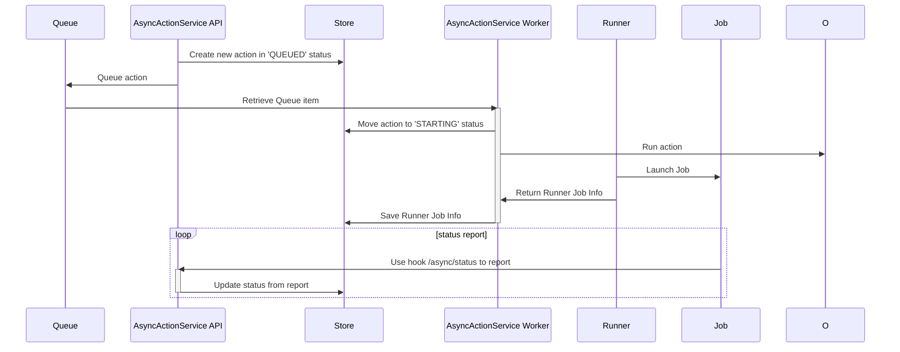

# Async Actions

This module allows you to execute and give status on jobs

## Architecture



## Runner


## Job

### Node

### Python

```
def job_headers():
    ts = str(round(time.time() * 1000))
    return {
        "X-Job-Id": environ.get("JOB_ID"),
        "X-Job-Time": ts,
        "X-Job-Hash": hmac.new(bytes(environ.get("JOB_SECRET_KEY"), 'latin-1'), msg=bytes(ts, 'latin-1'), digestmod=hashlib.sha256).hexdigest().lower()
    }

def send_status(data=None):
    ts = str(round(time.time() * 1000))
    # https://docs.python.org/3/library/http.client.html
    r = requests.post(environ.get("JOB_HOOK"), data, headers=job_headers())
    sleep(10)
    return r.json()

def download_from(model: string, uuid: string, attribute: string, index: int):
    # Get the download link from the service
    r = requests.post(environ.get("JOB_HOOK") + "/download", {
        "model": model,
        "uuid": uuid,
        "attribute": attribute,
        "index": index
    }, headers=job_headers())
    if (r.status != 200):
        raise Exception("Cannot download from whale")
    res = r.json()
    # 
    pass

def upload_to(model: string, uuid: string, attribute: string, filepath: string, metadata = None):
    # Get the upload link from the service
    r = requests.post(environ.get("JOB_HOOK") + "/upload", {
        "model": model,
        "uuid": uuid,
        "attribute": attribute,
        "index": index
    }, headers=job_headers())
    pass
```