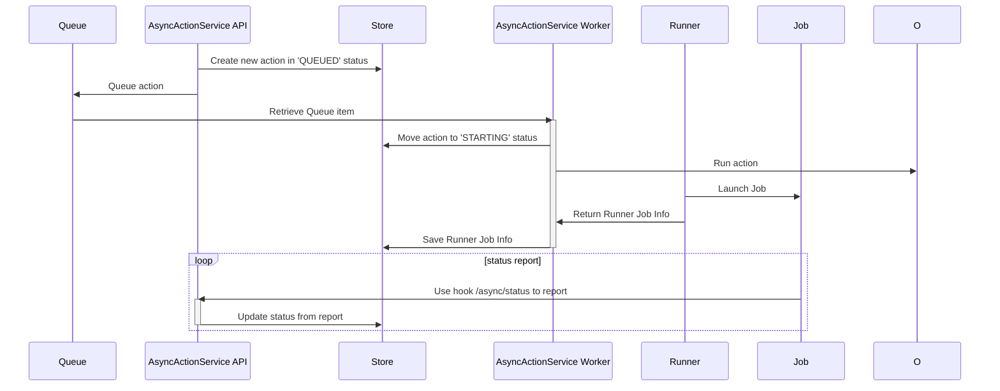

# Async Actions

This module allows you to execute and give status on jobs

## Architecture

```mermaid
sequenceDiagram
	participant Q as Queue
    participant Aa as AsyncActionService API
    participant S as Store
    
    participant Ar as AsyncActionService Worker
	participant R as Runner
	participant J as Job
    Aa->>S: Create new action in 'QUEUED' status
	Aa->>Q: Queue action
    Q->>Ar: Retrieve Queue item
	
	activate Ar
	Ar->>S: Move action to 'STARTING' status
	Ar->>O: Run action
	R->>J: Launch Job
	R->>Ar: Return Runner Job Info
	Ar->>S: Save Runner Job Info
	deactivate Ar
	loop status report
	J->>Aa: Use hook /async/status to report
	activate Aa
	Aa->>S: Update status from report
	deactivate Aa
	end
```

## Runner