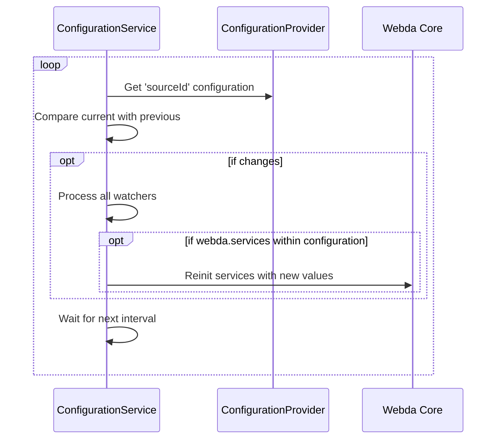

# Configuration Service

The Configuration Service allows you to get new configuration dynamically either by watching the configuration store or by checking at regular interval.

It will trigger only when the object changes.

If inside the object, at path `webda.services` it will update services configuration dynamically.

```
{
    "mycustom": "test",
    ...
    "webda": {
		"parameters": {
			"param2": "test"
		},
        "services": {
            "MyService": {
                "param1": "dynamic"
            }
        }
    }
}
```

The configuration shared parameters is also available.

A service cannot be changed into another type of service for security purpose.
Creating dynamic route through the ConfigurationService is not recommended, it will be probably be block in the near future.

This is the general process if the ConfigurationProvider cannot trigger



This is the general process if the ConfigurationProvider can trigger, it will be on demand

## Existing Configuration Provider

- Every {@link Store} as it is designed in the parent class
- {@link FileConfiguration} to simply use a file as configuration
- {@link KubernetesConfiguration} to simply use Kubernetes Secrets or ConfigMap

## String Encryption

Configuration file can be encrypted using the `encrypt` command.

Several modes are available:

- `gcp`: encrypted using a GCP KMS key (@webda/gcp required)
- `local`: encrypted using local machine id
- `password`: encrypted using a password (@webda/runtime required)

### How to use

Prefix the string you want to encrypt with the mode you want to use.

```config.json
{
	"mysecret": "encrypt:gcp:mysecret"
}
```

Then run the command

```
webda config-encrypt config.json
```

If you need to migrate you can use, it will reencrypt all the encrypted strings with the new mode

```
webda config-encrypt --migrate gcp config.json
```

To define default KMS key for GCP use `WEBDA_GCP_KMS_KEY=projects/myproject/locations/us-central-1/keyRings/mykeyring/cryptoKeys/mykey` environment variable.
