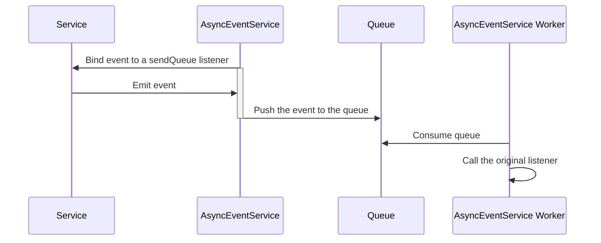

# Events

The framework use the EventEmitter for events.

`emit()` this will not wait for any promise returned by listeners

`emitSync()` this will wait for resolution on all promises returned by listeners

We also have a mechanism to listen asynchronously to events. They will then be posted to a Queue for them
to be consumed through a `AsyncEvent.worker()`

### Webda.Init

### Webda.Init.Services

### Webda.Create.Services

### Webda.NewContext

### Webda.Request

### Store.Save

### Store.Saved

### Store.Update

### Store.Updated

### Store.PartialUpdate

### Store.PArtialUpdated

### Store.Delete

### Store.Deleted

### Store.Get

### Store.Find

### Store.Found

### Store.WebCreate

### Store.WebUpdate

### Store.WebGet

### Store.WebDelete

### Store.Action

### Store.Actionned

