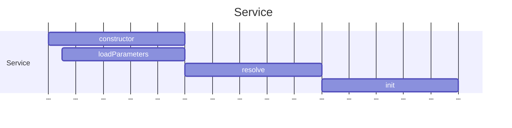

# Services

## Bean

When you create a service and declare @Route annotation, the service becomes a Bean, it won't be reusable

## Lifecycle

The service will be created based on webda.config definition



## Generic Parameters

A Service is a generic class that has at least 2 Parameters:

```
Service<T extends ServiceParameters,E extends Events>

T: Define the class that define and load the parameters from the configuration
E: Define the events and their types that the service emits
```

## Dependencies

### @Inject

You can use @Inject to retrieve another Service

## Predefined Services

Webda have some predefined services that are created by default:

| Name           | Description                                                    | Default Type               |
| -------------- | -------------------------------------------------------------- | -------------------------- |
| Configuration  | Load the configuration from the configuration file             | N/A                        |
| Registry       | The default storage for objects in Webda                       | Webda/MemoryStore          |
| CryptoService  | The service that provide the encryption and decryption of data | Webda/CryptoService        |
| Router         | The service that manage the routing of the application         | N/A or Dummy (TBD)         |
| SessionManager | The service that manage the session of the user                | Webda/CookieSessionManager |
