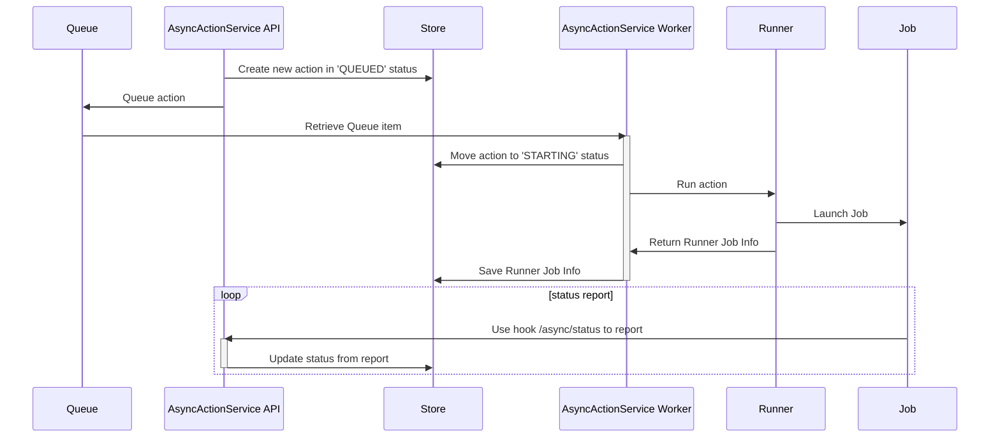
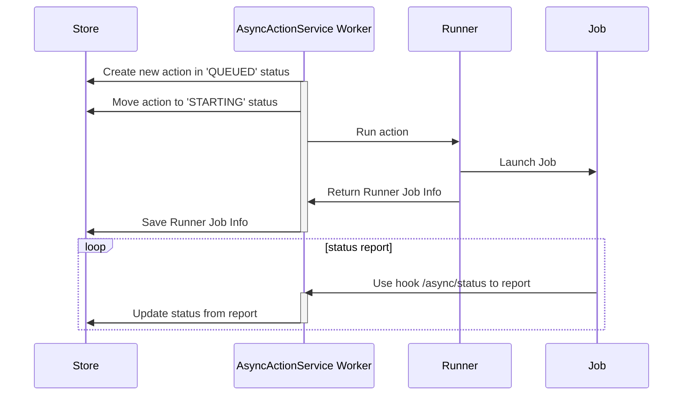
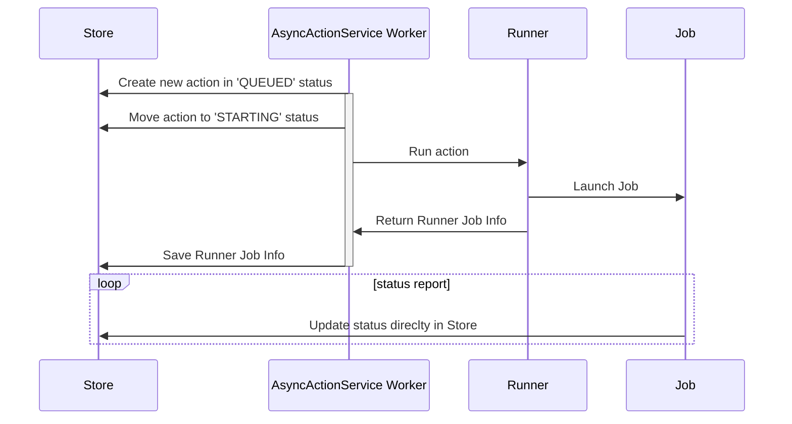

# Async Actions

This module allows you to execute background tasks (called AsyncAction).
An AsyncAction can run as a child process (LocalRunner), a promise (ServiceRunner) or a kubernetes job (KubeRunner of @webda/kubernetes module).

Using child process or kubernetes job allows you to use other languages to implement your AsyncAction.

When promise is used, you need to implement in Typescript of course.

The AsyncJobService will store the information in a Store, launch the AsyncAction passing it the JobInfo that allows the action to update its status.

The AsyncJobService also allow you to schedule the AsyncAction.

Currently to use Cron with something else than an AsyncOperationAction, you need to create an AsyncOperationAction that will then launch the real AsyncAction.

## Architecture

Flow with a Queue



Flow with local run and http hook status



Flow with local run with WebdaAction only



## Runner

The runner is the service responsible to launch the action effectively.
It can pick which action it can handle by implementing the method `handleType`

This way you can decide to execute your Python Action with a KubernetesJob configuration and the other with another configuration or a child_process.

### LocalRunner

This runner execute a process locally by using the `child_process`

### ServiceRunner

This runner execute only another service method within the same NodeJS process
It can only be used with AsyncOperationAction

### KubeRunner

This runner launch a Job in a Kubernetes

## Job

### Webda

You can define a Kubernetes Job configuration that run your webda image

```
webda launch AsyncService runAsyncOperationAction
```

Where AsyncService is the name of your AsyncService instance.
It will pick up automatically the job info from the environment variables, run the target operation and post its status

### Python

You can interact with the AsyncJobService API with this primitives.

```python title="job.py"

def check_job():
    if (
        environ.get("JOB_ID") is None
        or environ.get("JOB_SECRET_KEY") is None
        or environ.get("JOB_HOOK") is None
    ):
        raise Exception("JOB_ID, JOB_SECRET_KEY and JOB_HOOK are required")


def job_headers():
    ts = str(round(time.time() * 1000))
    return {
        "X-Job-Id": environ.get("JOB_ID"),
        "X-Job-Time": ts,
        "X-Job-Hash": hmac.new(
            bytes(environ.get("JOB_SECRET_KEY"), "latin-1"),
            msg=bytes(ts, "latin-1"),
            digestmod=hashlib.sha256,
        )
        .hexdigest()
        .lower(),
    }


def send_status(data=None):
    """
    Send Job Status
    """
    ts = str(round(time.time() * 1000))
    # https://docs.python.org/3/library/http.client.html
    r = requests.post(
        environ.get("JOB_HOOK") + "/status", json=data, headers=job_headers()
    )
    return r.json()


def download_from(
    store: string, uuid: string, property: string, index: int, dirpath: string
):
    """
    Download a file related to the Job
    """
    # Get the download link from the service
    r = requests.get(
        "{hook}/download/{store}/{uuid}/{property}/{index}".format(
            hook=environ.get("JOB_HOOK"),
            store=store,
            uuid=uuid,
            property=property,
            index=index,
        ),
        headers=job_headers(),
    )
    if r.status_code != 200:
        raise Exception("Cannot download")
    res = r.json()
    filename = path.join(dirpath, res["Map"]["hash"])
    if path.exists(filename):
        print("Already downloaded")
        return
    dwl = requests.get(res["Location"])
    if r.status_code != 200:
        raise Exception("Cannot download from redirect")
    with open(path.join(dirpath, res["Map"]["hash"]), "wb") as f:
        f.write(dwl.content)
    return filename


def upload_to(
    store: string, uuid: string, property: string, filepath: string, metadata={}
):
    """
    Upload a file related to the Job
    """
    file_hash = hashlib.md5()
    challenge = hashlib.md5()
    challenge.update("WEBDA".encode())
    with open(filepath, "rb") as f:
        while chunk := f.read(8192):
            file_hash.update(chunk)
            challenge.update(chunk)
    # Get the upload link from the service
    r = requests.put(
        "{hook}/upload/{store}/{uuid}/{property}".format(
            hook=environ.get("JOB_HOOK"),
            store=store,
            uuid=uuid,
            property=property,
        ),
        json={
            "hash": file_hash.hexdigest(),
            "challenge": challenge.hexdigest(),
            "metadata": metadata,
        },
        headers=job_headers(),
    )
    if r.status_code != 200:
        raise Exception("Upload failed")
    res = r.json()
    # If file is already known to the system
    if res["done"]:
        print("Already uploaded")
        return
    with open(filepath, "rb") as f:
        res = requests.request(res["method"], res["url"], data=f)
        if res.status_code >= 300:
            raise Exception("Upload failed")

```
