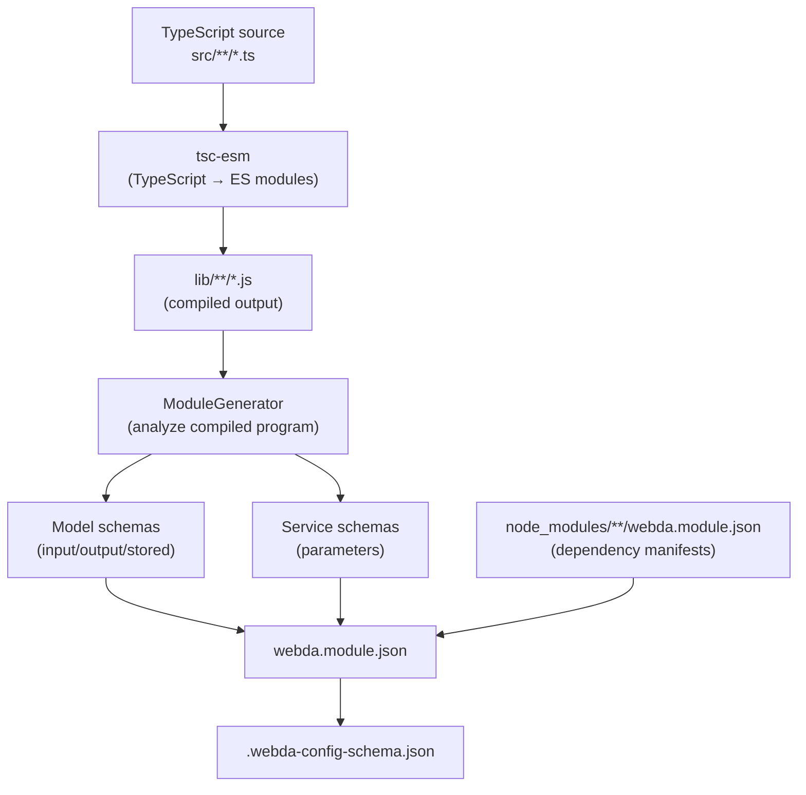

# `webdac build` — TypeScript Compilation Pipeline

`webdac build` is the primary build command for Webda applications. It compiles TypeScript, generates the module manifest, and produces JSON Schemas — all in one step.

## What it does



**Step-by-step:**

1. **Incremental check** — computes a digest of the source tree; if nothing changed since the last build (and `webda.module.json` is intact), skips recompilation.
2. **TypeScript compilation** — runs `@webda/tsc-esm` to emit ES module JavaScript into `lib/`.
3. **Module analysis** — `ModuleGenerator` walks the compiled TypeScript program to discover:
   - Models (`Model`, `UuidModel`, or any subclass)
   - Services (beans, moddas)
   - Deployers
   - Operations (`@Operation()` methods)
4. **Schema generation** — `@webda/schema`'s `SchemaGenerator` produces JSON Schemas for each model (input, output, stored views) and each service's parameters.
5. **Module merge** — walks `node_modules` for `webda.module.json` files from Webda dependencies and merges their `moddas`, `deployers`, and `schemas` sections into the local manifest.
6. **Write outputs** — writes `webda.module.json` and `.webda-config-schema.json`.

## Usage

```bash
# One-shot build
webdac build

# Watch mode — rebuilds on file changes
webdac build --watch

# Specify a different app directory
webdac build --appPath /path/to/my-app
```

## Options

| Flag | Default | Description |
|------|---------|-------------|
| `--watch` / `-w` | `false` | Watch for file changes and rebuild |
| `--code` / `-c` | — | Pre-run `webdac code` before compiling |
| `--appPath` | `.` | Path to the application root (must contain `tsconfig.json`) |

## Real build output (blog-system)

Running `webdac build` in `sample-apps/blog-system`:

```
2026-04-26T14:06:03.932Z [ INFO] Adding schema for WebdaSample/Post.publish.input
2026-04-26T14:06:03.932Z [ INFO] Adding schema for WebdaSample/Post.publish.output
2026-04-26T14:06:03.935Z [ INFO] Adding schema for WebdaSample/User.follow.input
2026-04-26T14:06:03.935Z [ INFO] Adding schema for WebdaSample/User.follow.output
...
2026-04-26T14:06:03.938Z [ INFO] Generating schemas 9
2026-04-26T14:06:03.939Z [ INFO] Generating schema for BinaryFile
2026-04-26T14:06:03.939Z [ INFO] Generating model schemas for Comment
2026-04-26T14:06:03.942Z [ INFO] Generating model schemas for Post
2026-04-26T14:06:03.947Z [ INFO] Generating model schemas for PostTag
2026-04-26T14:06:03.949Z [ INFO] Generating schema for Publisher
2026-04-26T14:06:03.951Z [ INFO] Generating model schemas for Tag
2026-04-26T14:06:03.952Z [ INFO] Generating schema for TestBean
2026-04-26T14:06:03.953Z [ INFO] Generating model schemas for User
2026-04-26T14:06:03.955Z [ INFO] Generating model schemas for UserFollow
```

## Generated files

After a successful build, the following files are created or updated:

```
my-app/
├── lib/                        # compiled JavaScript (gitignore)
│   └── models/
│       └── post.js
├── webda.module.json           # module manifest (commit this)
└── .webda/
    └── config.schema.json      # VS Code autocomplete schema
```

## Watch mode

```bash
webdac build --watch
```

In watch mode, the compiler listens for TypeScript file changes using the TypeScript watch API. When source files change, it re-runs the full pipeline (compilation + module generation). Useful during development alongside `webda debug`.

## Incremental builds

The compiler stores a cache in `.webda/cache`:

```json
{
  "sourceDigest": "abc123",
  "moduleDigest": "def456"
}
```

If `sourceDigest` matches the current source tree and `moduleDigest` matches `webda.module.json` on disk, the build is skipped entirely. This makes subsequent builds in watch mode very fast.

## Integration with `pnpm run build`

In the Webda monorepo, `pnpm run build` in a package typically runs:

```json
{
  "scripts": {
    "build": "webdac build"
  }
}
```

## Verify

```bash
cd sample-apps/blog-system
node ../../packages/compiler/lib/shell.js build
```

```
2026-04-26T14:06:03.932Z [ INFO] Adding schema for WebdaSample/Post.publish.input
...
2026-04-26T14:06:03.955Z [ INFO] Generating model schemas for UserFollow
```

Check that `webda.module.json` was updated:

```bash
ls -la sample-apps/blog-system/webda.module.json
```

## See also

- [Code Generation](./CodeGen.md) — `webdac code` for boilerplate method generation
- [Module Manifest](./ModuleManifest.md) — the structure and purpose of `webda.module.json`
- [Plugins](./Plugins.md) — extending the compiler with custom morpher modules
- [@webda/schema JSON Schema](../schema/JSON-Schema.md) — schema generation details
