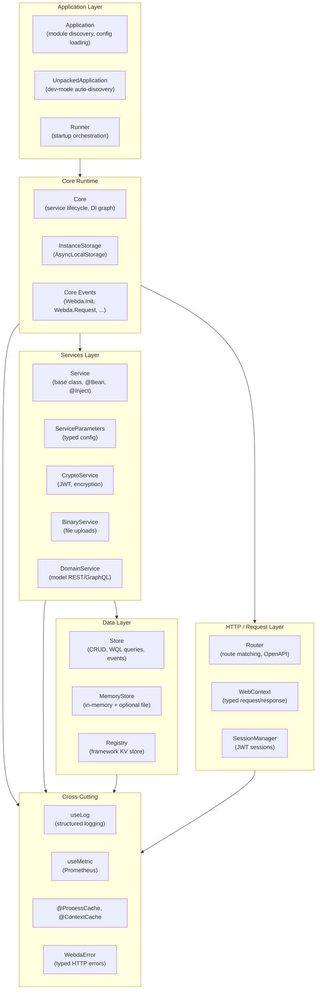
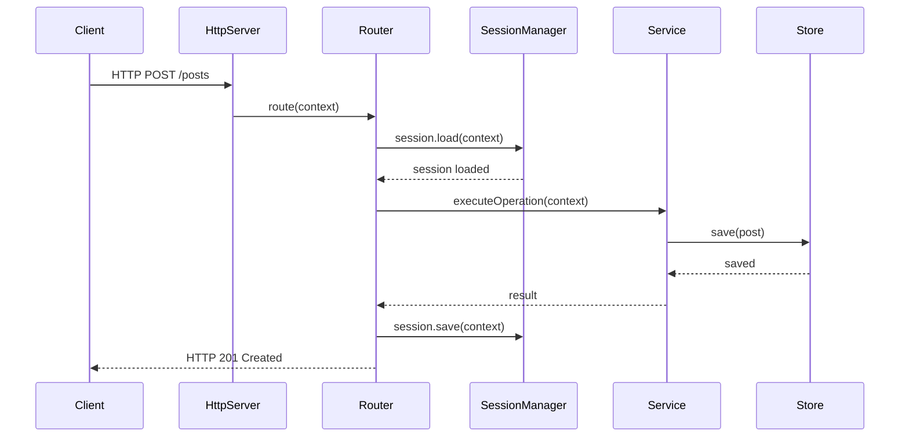

# Architecture

`@webda/core` is organized into six layers. Each layer has a clear responsibility, and dependencies only flow downward.

## The 6-layer diagram



## Layer descriptions

### 1. Application Layer

Responsible for **discovering modules** and **loading configuration** before anything starts.

- **`Application`** — reads `webda.config.json`, scans `webda.module.json` from installed packages, builds the model and service registry.
- **`UnpackedApplication`** — development variant; auto-discovers source-level `webda.module.json` and creates default infrastructure services (Router, Registry, CryptoService, SessionManager).
- **`Runner`** — orchestrates startup: `new Core(app)` → `core.init()` → `core.run()` → `SIGINT` graceful shutdown.

### 2. Core Runtime

The central orchestrator.

- **`Core`** — creates, resolves, and initializes all services. Tracks the lifecycle state machine: `initial → loading → initializing → ready → stopping → stopped`.
- **`InstanceStorage`** — `AsyncLocalStorage`-based storage that holds the current `Core`, `Application`, `Router`, and request context. Powers the hooks pattern.
- **Core Events** — `Webda.Init`, `Webda.Request`, `Webda.Result`, `Webda.404`, `Webda.OperationSuccess`, `Webda.Configuration.Applied`.

### 3. Services Layer

All application logic lives in services.

- **`Service<P>`** — base class. Provides `@Inject`, `@Route`, logging, metrics, `init()`, `resolve()`, `stop()`.
- **`ServiceParameters`** — typed config base class. Extend to declare your service's configuration shape.
- **`DomainService`** — special service that reads the model graph and auto-exposes REST and GraphQL endpoints.

### 4. Data Layer

Persistent storage with query support.

- **`Store<T>`** — abstract CRUD store with WQL query support and event emission.
- **`MemoryStore`** — in-process store (no network). Default store for development and testing.
- **`Registry`** — key-value store for framework internals (crypto keys, session data). Backed by any `Store`.

### 5. HTTP / Request Layer

Handles incoming HTTP requests.

- **`Router`** — matches HTTP requests to service `@Route` methods, manages CORS, OpenAPI spec.
- **`WebContext`** — typed request/response context. Access body, headers, session, user.
- **`SessionManager`** — abstract session load/save. Default: JWT tokens in secure cookies.

### 6. Cross-Cutting Concerns

Shared infrastructure available everywhere.

- **`useLog(name)`** — per-service structured logger backed by `@webda/workout`.
- **`useMetric(type, config)`** — Prometheus counters, gauges, histograms with auto-labeling.
- **`@ProcessCache`, `@ContextCache`, `@SessionCache`, `@InstanceCache`** — scoped caching decorators.
- **`WebdaError`** — typed HTTP errors that map to status codes (400, 401, 403, 404, 409, 429, ...).

## Request flow



## Hooks API

The `AsyncLocalStorage` pattern allows any code in the call stack to access framework singletons without passing references:

```typescript
import { useCore, useService, useContext, useCurrentUser } from "@webda/core";

// From anywhere in a request handler:
const core = useCore();
const registry = useService("Registry");
const context = useContext();
const user = await useCurrentUser();
```

## See also

- [Service Lifecycle](./Lifecycle.md) — the `resolve → init → run → stop` sequence
- [Services](./Services.md) — `Service` base class and dependency injection
- [Stores](./Stores.md) — the data layer API
- [Context](./Context.md) — `WebContext` and session management
- [Routing](./Routing.md) — how routes are derived from services and models
- [Events](./Events.md) — the event system
- [Errors](./Errors.md) — typed HTTP error classes
