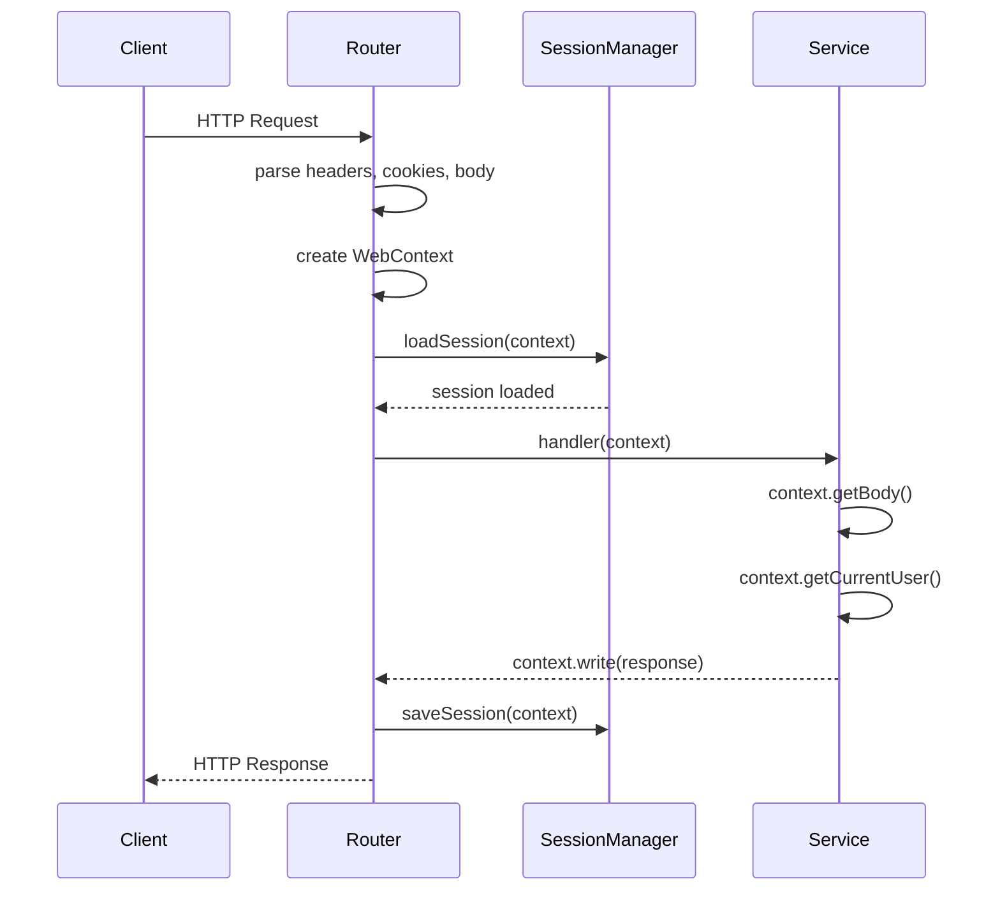

# Context

`WebContext` (and its `OperationContext<I, P, O>` base) is the request/response envelope that flows through every HTTP request in Webda. It carries the parsed body, headers, session, and the authenticated user.

## `WebContext` API

```typescript
interface WebContext {
  // Request
  getHttpContext(): HttpContext;
  getBody<T = any>(): T;
  getHeader(name: string): string | undefined;
  getParameters(): Record<string, string>;
  getPathParameter(name: string): string | undefined;
  getQueryString(): string;

  // Response
  write(data: any): void;
  writeHead(statusCode: number, headers?: Record<string, string>): void;
  statusCode(code: number): void;

  // Session
  getSession(): Session;
  getCurrentUserId(): string | undefined;
  getCurrentUser<T = any>(): Promise<T | undefined>;
  isAuthenticated(): boolean;

  // Lifecycle
  init(): Promise<void>;
  end(): Promise<void>;
}
```

## Accessing context

From any service method or operation handler, use `useContext()`:

```typescript
import { useContext, useCurrentUser } from "@webda/core";

@Bean
export class MyService extends Service {
  @Route("/profile", ["GET"])
  async getProfile(context: WebContext): Promise<void> {
    const user = await context.getCurrentUser();
    if (!user) {
      context.statusCode(401);
      context.write({ error: "Not authenticated" });
      return;
    }
    context.write({ username: user.username, email: user.email });
  }
}

// Or from anywhere in the call stack:
async function doWork() {
  const context = useContext();
  const userId = context.getCurrentUserId();
}
```

## `OperationContext<I, P, O>` — typed context

The generic `OperationContext<Input, Parameters, Output>` allows fully typed input/output:

```typescript
import { OperationContext, Route, Service } from "@webda/core";

interface CreatePostInput {
  title: string;
  slug: string;
  content: string;
}

interface CreatePostOutput {
  slug: string;
  title: string;
  createdAt: Date;
}

@Bean
export class PostService extends Service {
  @Route("/posts", ["POST"])
  async createPost(
    ctx: OperationContext<CreatePostInput, {}, CreatePostOutput>
  ): Promise<void> {
    const body = ctx.getBody();        // typed as CreatePostInput
    const post = await this.create(body);
    ctx.statusCode(201);
    ctx.write(post);                   // typed as CreatePostOutput
  }
}
```

## Session management

Sessions are managed by `SessionManager`. By default, Webda uses JWT tokens stored in a secure HTTP-only cookie.

### Reading session data

```typescript
const session = context.getSession();
const customData = session["myCustomKey"];
const userId = session["userId"];  // set by AuthenticationService
```

### Writing session data

```typescript
context.getSession()["myCustomKey"] = "myValue";
// Session is automatically saved at the end of the request
```

### Setting the authenticated user

The `SessionManager` sets `userId` in the session. Authentication services (like `@webda/authentication`) populate this field.

```typescript
// In an authentication service:
context.getSession()["userId"] = user.uuid;
```

## Request lifecycle



## Running code as system

Use `runAsSystem()` to bypass context-based permission checks for background tasks:

```typescript
import { runAsSystem } from "@webda/core";

await runAsSystem(async () => {
  // Code here runs without a user context
  await Post.getRepository().query("status = 'published'");
});
```

## Accessing context from model methods

Model methods (like `canAct`) receive the context as a parameter. Inside `@Operation` methods, use `useContext()`:

```typescript
import { Operation, useContext } from "@webda/core";

export class User extends UuidModel {
  @Operation()
  async changePassword(newPassword: string): Promise<void> {
    const context = useContext();
    const requestingUserId = context.getCurrentUserId();
    if (requestingUserId !== this.uuid) {
      throw new WebdaError.Forbidden("Can only change your own password");
    }
    this.password = hashPassword(newPassword);
    await this.save();
  }
}
```

## Verify

```bash
# Test context in a running server
cd sample-apps/blog-system
# (server running at https://localhost:18080)

# Authenticated request
curl -sk https://localhost:18080/profile \
  -H "Cookie: webda-session=<jwt-token>" | jq .

# Unauthenticated request (should return 401)
curl -sk -o /dev/null -w "%{http_code}" https://localhost:18080/profile
```

> **Note**: Requires the blog-system server to be running. The session JWT is obtained by calling `POST /users/login` first.

## See also

- [Services](./Services.md) — `@Route` handlers receive a `WebContext`
- [Routing](./Routing.md) — how routes are matched and context is created
- [Events](./Events.md) — `Webda.Request` fires with the context for each request
- [Errors](./Errors.md) — error types that affect the response status
- [@webda/authentication](../authentication/README.md) — sets the authenticated user in context
