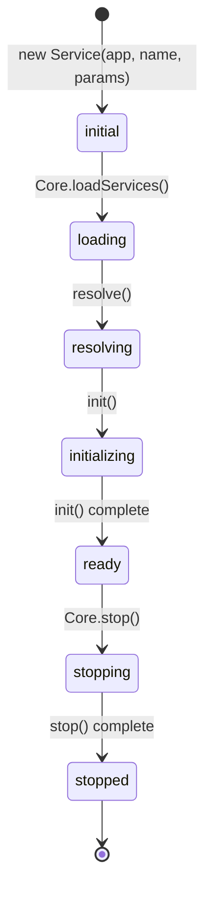
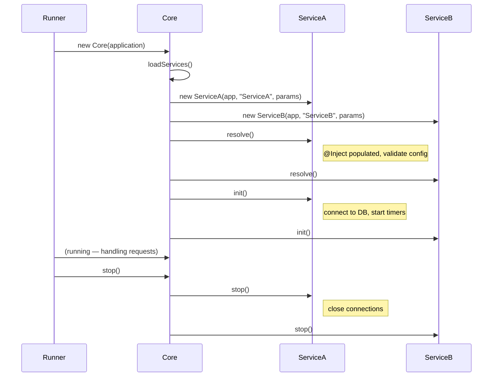

# Service Lifecycle

Every Webda service follows a strict lifecycle managed by `Core`. Understanding this sequence is essential to writing services that initialize resources correctly and shut down cleanly.

## Lifecycle state machine



## Lifecycle phases

### 1. Constructor

Called when the framework instantiates the service. The constructor must call `super(app, name, params)`. Do **not** do async work here.

```typescript
export class MyService extends Service<MyServiceParameters> {
  protected connection: DatabaseConnection;

  constructor(app: Application, name: string, params: any) {
    super(app, name, params);
    // Synchronous init only — no async, no network calls
  }
}
```

### 2. `resolve(): Promise<this>`

Called after all services are instantiated, before `init()`. Use `resolve()` to:
- Validate configuration
- Resolve `@Inject` dependencies (already injected by the time `resolve()` runs)
- Connect to other services

```typescript
async resolve(): Promise<this> {
  await super.resolve();  // always call super first

  if (!this.parameters.apiKey) {
    throw new Error("apiKey is required in MyService configuration");
  }

  // At this point @Inject dependencies are already populated
  this.log.info("Resolved with store:", this.store.getName());

  return this;
}
```

### 3. `init(): Promise<this>`

Called after `resolve()`. Use `init()` for async initialization:
- Open database connections
- Start background tasks
- Register event handlers

```typescript
async init(): Promise<this> {
  await super.init();

  this.connection = await DatabaseConnection.connect(this.parameters.url);
  this.log.info("Connected to database", { url: this.parameters.url });

  return this;
}
```

### 4. Running

The service is fully initialized. The application handles requests and the service processes them normally.

### 5. `stop(): Promise<void>`

Called during graceful shutdown (SIGINT, `Core.stop()`). Release resources in reverse order of acquisition:

```typescript
async stop(): Promise<void> {
  this.log.info("Shutting down");

  // Close resources before calling super
  await this.connection.close();
  await this.backgroundTask.cancel();

  await super.stop();  // call super last
}
```

## Complete example

```typescript
import { Service, ServiceParameters, Inject } from "@webda/core";
import { Bean } from "@webda/core";
import { useLog } from "@webda/workout";

interface EmailServiceParameters extends ServiceParameters {
  smtpHost: string;
  smtpPort: number;
  from: string;
}

@Bean
export class EmailService extends Service<EmailServiceParameters> {
  protected log = useLog("EmailService");
  protected transport: any;

  async resolve(): Promise<this> {
    await super.resolve();

    if (!this.parameters.smtpHost) {
      throw new Error("smtpHost is required");
    }

    this.log.info("Configuration validated", {
      host: this.parameters.smtpHost,
      port: this.parameters.smtpPort
    });

    return this;
  }

  async init(): Promise<this> {
    await super.init();

    // Create SMTP transport
    this.transport = createTransport({
      host: this.parameters.smtpHost,
      port: this.parameters.smtpPort ?? 587
    });

    this.log.info("SMTP transport initialized");
    return this;
  }

  async stop(): Promise<void> {
    this.log.info("Closing SMTP transport");
    this.transport?.close();
    await super.stop();
  }

  async sendEmail(to: string, subject: string, body: string): Promise<void> {
    await this.transport.sendMail({
      from: this.parameters.from,
      to,
      subject,
      html: body
    });
  }
}
```

## Sequence diagram



## Key rules

1. **Always call `await super.resolve()`** first in `resolve()`.
2. **Always call `await super.init()`** first in `init()`.
3. **Call `await super.stop()` last** in `stop()` (reverse order).
4. **Never do async work in the constructor** — use `init()`.
5. **Never access `@Inject` dependencies in the constructor** — they are not yet populated. Access them in `resolve()` or later.

## Verify

```bash
cd packages/core
pnpm test
```

```
✓ packages/core — service lifecycle tests pass
```

## See also

- [Architecture](./Architecture.md) — how `Core` orchestrates the lifecycle
- [Services](./Services.md) — `Service` base class, `@Bean`, `@Inject`
- [Events](./Events.md) — `Webda.Init` and other lifecycle events
