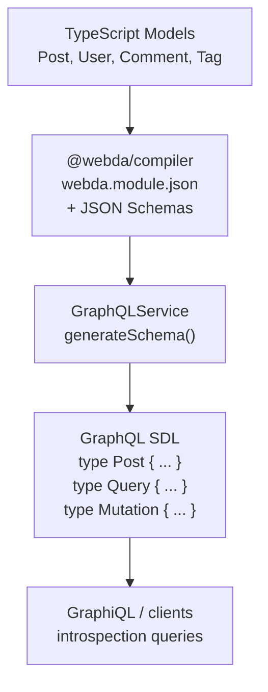

# GraphQL Schema Generation

`@webda/graphql` dynamically generates a GraphQL schema from your Webda domain models at startup. No hand-written SDL (Schema Definition Language) is required — the schema is derived from the model JSON Schemas produced by `@webda/compiler`.

## How it works



At startup, `GraphQLService.generateSchema()`:
1. Reads all models registered in the application
2. Skips non-final models (base classes shadowed by app-specific subclasses)
3. Converts each model's JSON Schema to a `GraphQLObjectType` + `GraphQLInputObjectType`
4. Registers standard CRUD operations (queries + mutations)
5. Registers subscription resolvers for model lifecycle events
6. Builds and caches the `GraphQLSchema` object

## Type mapping

TypeScript / JSON Schema types are mapped to GraphQL scalar types:

| TypeScript / JSON Schema | GraphQL type |
|--------------------------|-------------|
| `string` (default) | `String` |
| `string` + `format: "date-time"` | `Date` (custom scalar) |
| `number` / `integer` | `Long` (custom scalar — handles numbers up to 2^52) |
| `boolean` | `Boolean` |
| `T[]` | `[T]` (GraphQL List) |
| `object` with properties | Anonymous `GraphQLObjectType` |
| `object` without properties | `Any` (custom scalar — JSON map) |

## Blog-system model → GraphQL types

The `Post` model from `sample-apps/blog-system/src/models/Post.ts`:

```typescript
export class Post extends Model {
  [WEBDA_PRIMARY_KEY] = ["slug"] as const;

  title!: string;          // → String
  slug!: string;           // → String (primary key — becomes arg in queries)
  content!: string;        // → String
  status!: "draft" | "published" | "archived";  // → String (enum collapsed)
  viewCount!: number;      // → Long
  createdAt!: Date;        // → Date
  author!: BelongTo<User>; // → User (resolved through relation)
  comments!: Contains<Comment>; // → [Comment]
  tags!: ManyToMany<Tag>;  // → [Tag]
}
```

The generated GraphQL types look like (simplified SDL):

```graphql
type Post {
  slug: String
  title: String
  content: String
  status: String
  viewCount: Long
  createdAt: Date
  updatedAt: Date
  author: User
  comments: [Comment]
  tags: [Tag]
}

input PostInput {
  slug: String
  title: String
  content: String
  status: String
  viewCount: Long
}

type Query {
  Post(slug: String): Post
  Posts(query: String, limit: Long, offset: String): PostList
  # ... other models
}

type PostList {
  results: [Post]
  continuationToken: String
}

type Mutation {
  createPost(Post: PostInput): Post
  updatePost(uuid: String, Post: PostInput): Post
  deletePost(uuid: String): DeleteResult
  # ... other models
}
```

## Introspection

The full schema is always available via GraphQL's standard introspection:

```graphql
{
  __schema {
    queryType { name }
    mutationType { name }
    subscriptionType { name }
    types { name kind }
  }
}
```

Or explore it interactively in GraphiQL at `/graphql` (when `exposeGraphiQL: true`).

## GraphiQL explorer

When `exposeGraphiQL: true` (the default), navigating to `https://localhost:18080/graphql` in a browser shows the GraphiQL IDE. It uses the standard GraphiQL HTML with CDN-loaded assets.

## Custom `@Operation` methods

When a model defines a method with `@Operation()`, the GraphQL service detects it and adds a corresponding mutation (or query):

```typescript
// From Post model
@Operation()
async publish(destination: "linkedin" | "twitter"): Promise<string> {
  return `${destination}_${this.slug}_${Date.now()}`;
}
```

This becomes:
```graphql
mutation {
  publishPost(slug: "my-post", destination: "linkedin")
}
```

## Accessing the SDL

You can inspect the generated SDL at runtime:

```typescript
import { printSchema } from "graphql";

// In a service or test, after the GraphQLService is initialized:
const graphqlService = useCore().getService("GraphQLService");
console.log(printSchema(graphqlService.schema));
```

## Verify

```bash
# Start the blog-system dev server
cd sample-apps/blog-system
pnpm run debug &
sleep 5

# Introspect the schema
curl -sk -X POST https://localhost:18080/graphql \
  -H "Content-Type: application/json" \
  -d '{"query":"{ __schema { queryType { name } mutationType { name } subscriptionType { name } } }"}' | jq .
```

Expected response:

```json
{
  "data": {
    "__schema": {
      "queryType": { "name": "Query" },
      "mutationType": { "name": "Mutation" },
      "subscriptionType": { "name": "Subscription" }
    }
  }
}
```

> **Note**: The blog-system server requires `pnpm run debug` in the `sample-apps/blog-system` directory. The verify command above will fail if the server is not running.

## See also

- [Queries and Mutations](./Queries-And-Mutations.md) — using the auto-generated CRUD operations
- [Subscriptions](./Subscriptions.md) — real-time event streaming over WebSocket
- [@webda/compiler](../compiler/README.md) — generates the model manifests that feed schema generation
- [@webda/models](../models/README.md) — defining models that become GraphQL types
