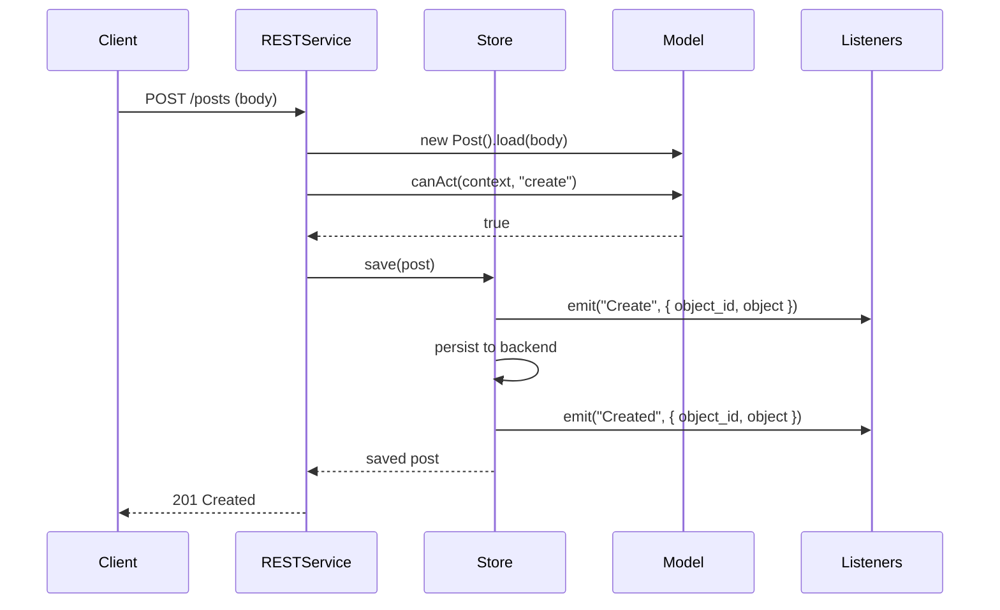

# Model Lifecycle and Events

Every Webda model emits typed events before and after each store operation. You can listen to these events to implement side effects like sending notifications, updating caches, or enforcing cross-model constraints.

## Lifecycle event phases

For each mutation operation, two events fire — one *before* (allows interception) and one *after* (notifications only):

| Operation | Before event | After event |
|-----------|-------------|-------------|
| Create | `Create` | `Created` |
| Update (full) | `Update` | `Updated` |
| Partial update | `PartialUpdate` | `PartialUpdated` |
| Delete | `Delete` | `Deleted` |
| Patch | `Patch` | `Patched` |
| Query | `Query` | `Queried` |

## Event type definitions

```typescript
// From packages/models/src/model.ts
export type ModelEvents<T = any> = {
  Create:         { object_id: string; object: T };
  PartialUpdate:  any;
  Delete:         { object_id: string };
  Update:         { object_id: string; object: T; previous: T };
  Patch:          { object_id: string; object: T; previous: T };
  Query:          { query: string };

  // After-events
  Created:        { object_id: string; object: T };
  PartialUpdated: any;
  Deleted:        { object_id: string };
  Patched:        { object_id: string; object: T; previous: T };
  Updated:        { object_id: string; object: T; previous: T };
  Queried:        { query: string; results: T[]; continuationToken?: string };
};
```

## Declaring custom events

Extend `ModelEvents<T>` with your own custom events using `WEBDA_EVENTS`:

```typescript
import { Model, WEBDA_PRIMARY_KEY, WEBDA_EVENTS, ModelEvents } from "@webda/models";

export class PostEvents<T extends Post> {
  Publish: { post: T };
}

export class Post extends Model {
  [WEBDA_PRIMARY_KEY] = ["slug"] as const;
  [WEBDA_EVENTS]: ModelEvents<this> & PostEvents<this>;

  slug!: string;
  title!: string;
  status!: "draft" | "published" | "archived";
}
```

## Emitting events from a model

```typescript
// In an @Operation method or service
export class Post extends Model {
  // ...

  async publish(destination: "linkedin" | "twitter"): Promise<string> {
    this.status = "published";
    await this.save();

    // Emit a custom event
    this.emit("Publish", { post: this });
    return `${destination}_${this.slug}_${Date.now()}`;
  }
}
```

## Listening to events on a repository

```typescript
import { Post } from "./models/Post";

// Listen on the Post repository for any Created event
Post.getRepository().on("Created", ({ object }) => {
  console.log(`Post created: ${object.slug}`);
});

// Listen to a specific object's events
const post = await Post.ref("hello-world").get();
post.on("Updated", ({ object, previous }) => {
  console.log(`Post updated: ${previous.title} → ${object.title}`);
});
```

## Listening to events in a service using `@On`

In Webda services, use the `@On` decorator to subscribe to store events:

```typescript
import { Bean } from "@webda/core";
import { On } from "@webda/core";
import { Service } from "@webda/core";
import { useLog } from "@webda/workout";

@Bean
export class NotificationService extends Service {
  protected log = useLog("NotificationService");

  @On("Store.Save:WebdaSample/Post")
  async onPostSaved(event: any): Promise<void> {
    const post = event.object;
    this.log.info(`Post saved: ${post.slug}`);
    // Send notification, update search index, etc.
  }

  @On("Store.Delete:WebdaSample/Post")
  async onPostDeleted(event: any): Promise<void> {
    const { object_id } = event;
    this.log.info(`Post deleted: ${object_id}`);
  }
}
```

## Dirty tracking

Models automatically track which fields have changed since the last load or save. The dirty set is stored under `model[WEBDA_DIRTY]`:

```typescript
import { WEBDA_DIRTY } from "@webda/utils";

const post = await Post.ref("hello-world").get();
console.log(post[WEBDA_DIRTY]); // Set {} — clean

post.title = "New Title";
console.log(post[WEBDA_DIRTY]); // Set { "title" } — title is dirty

await post.save();
console.log(post[WEBDA_DIRTY]); // Set {} — clean again
```

This is used internally by stores to emit partial update events and to optimize database writes.

## User-defined lifecycle hooks (canAct)

While `canAct` is primarily a permission check, it runs in the request lifecycle before the store operation, so it can also be used to implement pre-save validation or transformation:

```typescript
export class Post extends Model {
  // ...

  async canAct(context: any, action: string): Promise<boolean> {
    if (action === "create" || action === "update") {
      // Auto-populate slug from title if not provided
      if (!this.slug && this.title) {
        this.slug = this.title.toLowerCase().replace(/[^a-z0-9]+/g, "-");
      }
    }
    return true;
  }
}
```

## Sequence diagram



## Verify

```bash
# Run model lifecycle tests
cd packages/models
pnpm test
```

```
✓ packages/models/src/model.spec.ts — lifecycle tests pass
```

## See also

- [Defining Models](./Defining-Models.md) — model base classes and field declarations
- [Actions](./Actions.md) — `@Operation` decorator
- [Core Events](../core/Events.md) — `Core.on`, store events, `@On` decorator
- [@webda/core Services](../core/Services.md) — services that listen to model events
