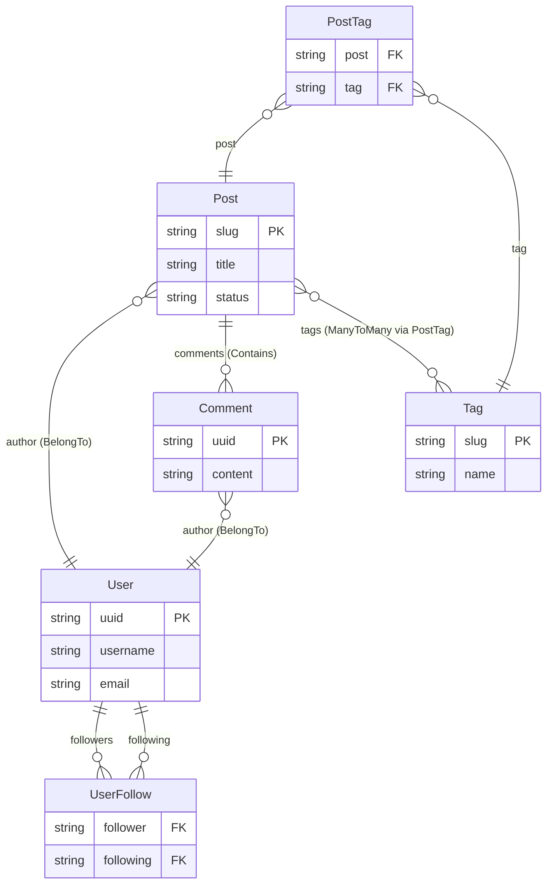

# Model Relationships

`@webda/models` provides typed relationship helpers for the four common cardinality patterns. All relationships are declared as TypeScript field types; the framework infers the store graph at build time.

## Relationship types at a glance

| Type | Cardinality | Ownership | Blog-system example |
|------|-------------|-----------|---------------------|
| `BelongTo<T>` | Many-to-one | No | `Comment.author → User` |
| `Contains<T>` | One-to-many | Yes (cascade delete) | `Post.comments → [Comment]` |
| `OneToMany<T, Owner, Field>` | One-to-many | No | `User.posts → [Post]` (via `Post.author`) |
| `ManyToMany<T>` | Many-to-many | Via join table | `Post.tags ↔ [Tag]` (via `PostTag`) |
| `RelateTo<T>` | Soft reference | No | — |

## BelongTo — Many-to-one reference

`BelongTo<T>` stores the primary key of the referenced model. It creates a "belongs to" foreign key relationship.

```typescript
import { UuidModel, BelongTo } from "@webda/models";
import type { User } from "./User";
import type { Post } from "./Post";

export class Comment extends UuidModel {
  content!: string;

  post!: BelongTo<Post>;    // Comment belongs to a Post
  author!: BelongTo<User>;  // Comment belongs to a User
}
```

REST implications:
- `Comment.postId` (the raw FK) is stored in the document
- `GET /comments/:uuid` includes the `postId` field
- Resolving the Post requires a separate `GET /posts/:slug`

## Contains — One-to-many with ownership

`Contains<T>` declares that the model "owns" the child models. The children are stored separately but associated with the parent.

```typescript
import { Model, WEBDA_PRIMARY_KEY, Contains } from "@webda/models";
import type { Comment } from "./Comment";

export class Post extends Model {
  [WEBDA_PRIMARY_KEY] = ["slug"] as const;

  slug!: string;
  title!: string;
  content!: string;

  comments!: Contains<Comment>;   // Post contains/owns Comments
}
```

REST implications:
- `GET /posts/:slug/comments` — list all comments for this post
- `POST /posts/:slug/comments` — create a comment on this post
- Deleting the Post cascades to its Comments

## OneToMany — One-to-many via foreign key

`OneToMany<T, Owner, Field>` is the inverse side of a `BelongTo`. It exposes a queryable collection without ownership.

```typescript
import { UuidModel, OneToMany } from "@webda/models";
import type { Post } from "./Post";
import type { UserFollow } from "./UserFollow";

export class User extends UuidModel {
  username!: string;
  email!: string;

  // Posts where Post.author = this user
  posts!: OneToMany<Post, User, "author">;

  // Followers (users who follow this user, via UserFollow.following)
  followers!: OneToMany<UserFollow, User, "following">;

  // Following (users this user follows, via UserFollow.follower)
  following!: OneToMany<UserFollow, User, "follower">;
}
```

REST implications:
- `GET /users/:uuid/posts` — list all posts by this user (queryable with WQL)

## ManyToMany — Many-to-many via join table

`ManyToMany<T>` expresses a many-to-many relationship. It requires a join table model on both sides.

```typescript
// Post side
import { ManyToMany } from "@webda/models";
import type { Tag } from "./Tag";

export class Post extends Model {
  tags!: ManyToMany<Tag>;
}

// Tag side
import { OneToMany } from "@webda/models";
import type { Post } from "./Post";

export class Tag extends Model {
  posts!: OneToMany<Post, Tag, "tags">;
}

// Join table — PostTag
import { Model, WEBDA_PRIMARY_KEY, BelongTo } from "@webda/models";
import type { Post } from "./Post";
import type { Tag } from "./Tag";

export class PostTag extends Model {
  [WEBDA_PRIMARY_KEY] = ["post", "tag"] as const;

  post!: BelongTo<Post>;
  tag!: BelongTo<Tag>;
}
```

REST implications:
- `GET /posts/:slug/tags` — list all tags for a post
- `POST /posts/:slug/tags/:tagSlug` — add a tag to a post
- `DELETE /posts/:slug/tags/:tagSlug` — remove a tag from a post

## Self-referential (User follows User)

```typescript
import { UuidModel, OneToMany } from "@webda/models";
import type { UserFollow } from "./UserFollow";

export class User extends UuidModel {
  followers!: OneToMany<UserFollow, User, "following">;
  following!: OneToMany<UserFollow, User, "follower">;
}
```

```typescript
// UserFollow join table — composite key
import { Model, WEBDA_PRIMARY_KEY, BelongTo } from "@webda/models";
import type { User } from "./User";

export class UserFollow extends Model {
  [WEBDA_PRIMARY_KEY] = ["follower", "following"] as const;

  follower!: BelongTo<User>;
  following!: BelongTo<User>;
  createdAt!: Date;
}
```

## Querying relations at runtime

All relation types expose a `.query(wql)` method that returns paginated results:

```typescript
// Get all published posts by a user
const { results } = await user.posts.query(`status = 'published' ORDER BY createdAt DESC LIMIT 10`);

// Get recent comments on a post
const { results: comments } = await post.comments.query(`ORDER BY createdAt DESC LIMIT 5`);
```

## Relationship graph diagram (blog-system)



## Verify

```bash
cd packages/models
npx vitest run src/relations.spec.ts
```

```
✓ packages/models/src/relations.spec.ts — all tests pass
```

## See also

- [Defining Models](./Defining-Models.md) — base classes and primary keys
- [Lifecycle](./Lifecycle.md) — hooks that fire on relation changes
- [Actions](./Actions.md) — custom operations on relations
- [WQL Syntax](../ql/Syntax.md) — the query language for relation queries
