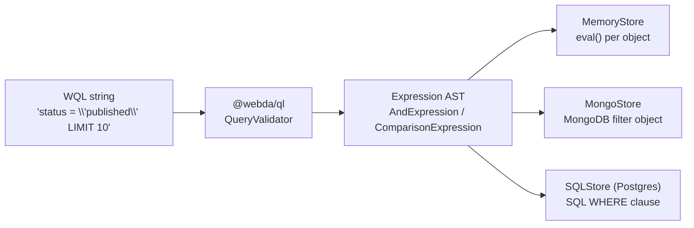

# Store Translators

Each Webda Store backend implements a `find(query: WebdaQL.Query)` method that translates the parsed WQL AST into its own native query format. This page documents how each backend translates common WQL constructs.

## Translation overview



## In-memory (MemoryStore)

The in-memory store (`packages/core/src/stores/memory.ts`) does not translate WQL to a secondary language — it uses the `QueryValidator.eval(object)` method directly to filter JavaScript objects in memory.

**How it works:**

```typescript
// Simplified from MemoryStore.find()
const validator = new WebdaQL.QueryValidator(query.filter.toString());
const results = Object.values(this.storage).filter(obj => validator.eval(obj));
```

**Characteristics:**
- No translation overhead — pure JS object inspection
- Supports all WQL operators exactly as specified
- LIMIT and OFFSET are applied post-filter (slice)
- ORDER BY is applied via `Array.sort()` using the `orderBy` fields

**Example:**

| WQL | In-memory behavior |
|-----|-------------------|
| `status = 'published'` | `obj.status === 'published'` |
| `viewCount >= 100` | `obj.viewCount >= 100` |
| `tags CONTAINS 'ts'` | `Array.isArray(obj.tags) && obj.tags.includes('ts')` |
| `title LIKE 'Intro%'` | `ComparisonExpression.likeToRegex('Intro%').test(obj.title)` |

---

## MongoDB (MongoStore)

The MongoDB store (`packages/mongodb/src/mongodb.ts`) translates the WQL AST into a MongoDB filter document using the `mapExpression()` method.

**Translation table:**

| WQL operator | MongoDB equivalent |
|-------------|-------------------|
| `field = value` | `{ field: value }` |
| `field != value` | `{ field: { $ne: value } }` |
| `field > value` | `{ field: { $gt: value } }` |
| `field >= value` | `{ field: { $gte: value } }` |
| `field < value` | `{ field: { $lt: value } }` |
| `field <= value` | `{ field: { $lte: value } }` |
| `field IN [a, b]` | `{ field: { $in: [a, b] } }` |
| `field LIKE "pattern"` | `{ field: /regex/ }` (via `ComparisonExpression.likeToRegex`) |
| `field CONTAINS value` | `{ field: value }` (MongoDB natively checks array membership) |
| `A AND B` | Merge both objects: `{ ...A, ...B }` |
| `A OR B` | `{ $or: [A, B] }` |

**Code reference (simplified):**

```typescript
// From packages/mongodb/src/mongodb.ts
mapExpression(expression: WebdaQL.Expression): any {
  if (expression instanceof WebdaQL.AndExpression) {
    return expression.children.reduce((q, e) => ({ ...q, ...this.mapExpression(e) }), {});
  }
  if (expression instanceof WebdaQL.OrExpression) {
    return { $or: expression.children.map(e => this.mapExpression(e)) };
  }
  if (expression instanceof WebdaQL.ComparisonExpression) {
    // Examples:
    // "="  → { [field]: value }
    // ">"  → { [field]: { $gt: value } }
    // "IN" → { [field]: { $in: value } }
    // "LIKE" → { [field]: /regex/ }
  }
}
```

**Example translations:**

```
WQL:   status = 'published' AND viewCount >= 100
Mongo: { status: "published", viewCount: { $gte: 100 } }

WQL:   status IN ['draft', 'published']
Mongo: { status: { $in: ["draft", "published"] } }

WQL:   status = 'draft' OR status = 'archived'
Mongo: { $or: [ { status: "draft" }, { status: "archived" } ] }

WQL:   title LIKE "Intro%"
Mongo: { title: /^Intro/i }
```

**ORDER BY / LIMIT / OFFSET:**

```
WQL:   ORDER BY createdAt DESC LIMIT 20 OFFSET "100"
Mongo: .sort({ createdAt: -1 }).skip(100).limit(20)
```

MongoDB uses a numeric offset (parsed from the continuation token string).

---

## PostgreSQL / SQL (SQLStore + PostgresStore)

The PostgreSQL store (`packages/postgres/src/`) uses a two-step approach:

1. **`duplicateExpression()`** walks the AST and converts it to `SQLComparisonExpression` nodes (which know how to emit SQL-safe strings).
2. **`toString()`** on the resulting AST emits a SQL WHERE clause fragment.

**Translation table:**

| WQL operator | SQL equivalent |
|-------------|---------------|
| `field = 'value'` | `field = 'value'` |
| `field != value` | `field != value` |
| `field > value` | `field > value` |
| `field >= value` | `field >= value` |
| `field < value` | `field < value` |
| `field <= value` | `field <= value` |
| `field IN [a, b]` | `field = 'a' OR field = 'b'` (expanded to OR) |
| `field CONTAINS value` | `(field)::jsonb ? 'value'` (JSONB array membership) |
| `field LIKE "Intro%"` | `field LIKE 'Intro%'` |
| `A AND B` | `A AND B` |
| `A OR B` | `A OR B` |

Note: `IN` is expanded to an OR chain of equality comparisons. `CONTAINS` uses PostgreSQL's `?` JSONB operator to check array membership.

**Example translations:**

```
WQL:  status = 'published' AND viewCount >= 100
SQL:  SELECT * FROM posts WHERE status = 'published' AND viewCount >= 100

WQL:  status IN ['draft', 'published']
SQL:  SELECT * FROM posts WHERE status = 'draft' OR status = 'published'

WQL:  tags CONTAINS 'typescript'
SQL:  SELECT * FROM posts WHERE (tags)::jsonb ? 'typescript'

WQL:  status = 'published' ORDER BY createdAt DESC LIMIT 20
SQL:  SELECT * FROM posts WHERE status = 'published' ORDER BY createdAt DESC LIMIT 20
```

---

## DynamoDB (DynamoStore)

DynamoDB's filter expressions are more restricted than SQL or MongoDB (no full table scans; queries are against a primary key or GSI). The DynamoStore translates WQL to DynamoDB `FilterExpression` objects for the filter portion and uses `KeyConditionExpression` for key-based lookups.

> The exact translation logic is in `packages/aws/src/services/dynamostore.ts`. Consult the source for the current implementation.

**Key differences:**
- Queries on non-key attributes require a scan, which is costly
- DynamoDB does not support `LIKE` natively — the store may evaluate LIKE in-memory after the DynamoDB query
- OFFSET uses `LastEvaluatedKey` JSON-encoded as a base64 string

---

## Verify

```bash
# Run the ql package tests to verify parsing and in-memory evaluation
npx vitest run packages/ql/src/query.spec.ts
```

```
✓ packages/ql/src/query.spec.ts > QueryTest > dev
✓ packages/ql/src/query.spec.ts > QueryTest > prependQuery
```

```bash
# Run the mongodb package tests (requires a running MongoDB) to verify MongoDB translation
cd packages/mongodb
pnpm test
```

## See also

- [WQL Syntax](./Syntax.md) — grammar and value types
- [Operators](./Operators.md) — operator reference with examples
- [@webda/ql README](./README.md) — package overview and API
- [@webda/core Stores](../core/Stores.md) — Store contract and query interface
