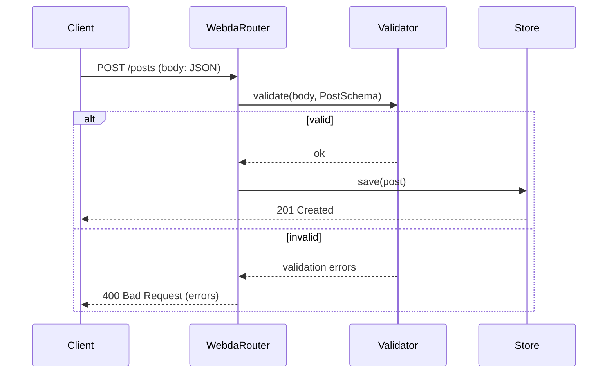

# Runtime Validation

`@webda/schema` generates JSON Schema documents from TypeScript types. Those schemas can be consumed by [ajv](https://ajv.js.org/) to validate incoming request bodies, configuration objects, or any JSON payload at runtime.

## How Webda uses it

The Webda framework validates incoming HTTP request bodies using the JSON Schemas derived from model type definitions. When a model field has JSDoc constraints (`@minLength`, `@format`, `@pattern`, etc.), the schema generator embeds those constraints, and the runtime validator enforces them.



## Setting up ajv validation

### Step 1: Generate the schema

```typescript
import { SchemaGenerator } from "@webda/schema";

const generator = new SchemaGenerator({ project: process.cwd() });
const userSchema = generator.getSchemaForTypeName("UserCreateInput");
```

### Step 2: Compile with ajv

```typescript
import Ajv from "ajv";
import addFormats from "ajv-formats";

const ajv = new Ajv({ allErrors: true });
addFormats(ajv);  // adds "email", "uri", "date-time", etc.

const validate = ajv.compile(userSchema);
```

### Step 3: Validate incoming data

```typescript
const body = {
  username: "jo",       // too short — @minLength 3
  email: "not-an-email", // invalid — @format email
  password: "secret8"
};

const valid = validate(body);
if (!valid) {
  console.log(validate.errors);
  // [
  //   { instancePath: "/username", message: "must NOT have fewer than 3 characters" },
  //   { instancePath: "/email",    message: "must match format \"email\"" }
  // ]
}
```

## Example model with constraints

```typescript
// From sample-apps/blog-system/src/models/User.ts

/**
 * User model representing blog authors and readers
 */
export class User extends UuidModel {
  /**
   * Unique username
   * @minLength 3
   * @maxLength 30
   * @pattern ^[a-zA-Z0-9_]+$
   */
  username!: string;

  /**
   * User's email address
   * @format email
   * @minLength 5
   * @maxLength 100
   */
  email!: string;

  /**
   * User biography
   * @maxLength 500
   */
  bio?: string;
}
```

The schema generator produces for `User.username`:

```json
{
  "username": {
    "description": "Unique username",
    "type": "string",
    "minLength": 3,
    "maxLength": 30,
    "pattern": "^[a-zA-Z0-9_]+$"
  }
}
```

And for `User.email`:

```json
{
  "email": {
    "description": "User's email address",
    "type": "string",
    "format": "email",
    "minLength": 5,
    "maxLength": 100
  }
}
```

## Triggering a 400 response

In a running Webda application, sending an invalid payload to a model endpoint returns a 400 with validation details:

```bash
# Start the blog-system dev server
cd sample-apps/blog-system
# (server must be running on port 18080)

curl -s -X POST http://localhost:18080/users \
  -H "Content-Type: application/json" \
  -d '{"username": "ab", "email": "not-valid", "password": "x"}' | jq .
```

Expected response (HTTP 400):

```json
{
  "code": 400,
  "message": "Validation error",
  "errors": [
    { "field": "username", "message": "must NOT have fewer than 3 characters" },
    { "field": "email",    "message": "must match format \"email\"" }
  ]
}
```

> **Note**: The exact error format depends on the Webda version. The above shows the conceptual structure; run the blog-system server to capture live output.

## Custom ajv configuration

For advanced validation scenarios you can pass additional ajv options:

```typescript
import Ajv from "ajv";
import { SchemaGenerator } from "@webda/schema";

const generator = new SchemaGenerator({ project: "./tsconfig.json" });

const ajv = new Ajv({
  allErrors: true,        // collect all errors, not just the first
  coerceTypes: false,     // do not mutate input (recommended)
  useDefaults: true,      // apply "default" values from schema
  strict: false           // allow unknown keywords (needed for some Webda extensions)
});

const schema = generator.getSchemaForTypeName("PostCreateInput");
const validate = ajv.compile(schema);
```

## Verify

```bash
# From packages/schema — run the full test suite which exercises validation scenarios
cd packages/schema
pnpm test
```

```
✓ packages/schema - X tests passed
```

## See also

- [JSON Schema Generation](./JSON-Schema.md) — how schemas are generated from TypeScript types
- [CLI reference](./CLI.md) — `webda-schema-generator` flags
- [@webda/compiler](../compiler/README.md) — automatic schema generation on `webdac build`
- [ajv documentation](https://ajv.js.org/) — the recommended runtime validator
