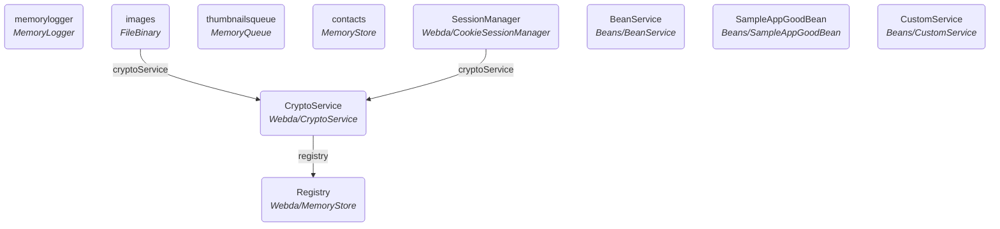

<!-- WEBDA:StorageDiagram -->

<!-- /WEBDA:StorageDiagram -->

<!-- WEBDA:ClassDiagram -->

```mermaid
flowchart BT
	Webda/AclModel --> CoreModel
	WebdaDemo/AbstractProject --> Webda/AclModel
	WebdaDemo/Project --> WebdaDemo/AbstractProject
	WebdaDemo/SubProject --> WebdaDemo/Project
	WebdaDemo/AnotherSubProject --> WebdaDemo/Project
	WebdaDemo/SubSubProject --> WebdaDemo/AnotherSubProject
	Webda/User --> CoreModel
	WebdaDemo/User --> Webda/User
	Webda/UuidModel --> CoreModel
	WebdaDemo/Student --> Webda/UuidModel
	WebdaDemo/Teacher --> Webda/UuidModel
	WebdaDemo/Course --> Webda/UuidModel
	WebdaDemo/Classroom --> Webda/UuidModel
	WebdaDemo/Hardware --> Webda/UuidModel
	WebdaDemo/ComputerScreen --> WebdaDemo/Hardware
	WebdaDemo/Brand --> Webda/UuidModel
	WebdaDemo/Company --> CoreModel
	WebdaDemo/Computer --> CoreModel
	WebdaDemo/Contact --> CoreModel
	Webda/AsyncAction --> CoreModel
	Webda/AsyncWebdaAction --> Webda/AsyncAction
	Webda/AsyncOperationAction --> Webda/AsyncAction
	Webda/Comment --> CoreModel
	Webda/OwnerModel --> CoreModel
	Webda/Ident --> Webda/OwnerModel
	Webda/ApiKey --> Webda/OwnerModel
	Webda/RoleModel --> CoreModel
	Webda/Deployment --> CoreModel

	subgraph Registry
		CoreModel
		Webda/AclModel
		WebdaDemo/AbstractProject
		WebdaDemo/Project
		WebdaDemo/SubProject
		WebdaDemo/AnotherSubProject
		WebdaDemo/SubSubProject
		Webda/User
		WebdaDemo/User
		Webda/UuidModel
		WebdaDemo/Student
		WebdaDemo/Teacher
		WebdaDemo/Course
		WebdaDemo/Classroom
		WebdaDemo/Hardware
		WebdaDemo/ComputerScreen
		WebdaDemo/Brand
		WebdaDemo/Company
		WebdaDemo/Computer
		Webda/AsyncAction
		Webda/AsyncWebdaAction
		Webda/AsyncOperationAction
		Webda/Comment
		Webda/OwnerModel
		Webda/Ident
		Webda/ApiKey
		Webda/RoleModel
		Webda/Deployment
	end

	subgraph contacts
		WebdaDemo/Contact
	end
```

```mermaid
classDiagram
	class AbstractProject{
		AbstractProject: This file contains several empty methods to test our auto docs

Abstract class should not be exported as model
		-_creationDate: string
		-_lastUpdate: string
		-_creator: string
		+acl()
	}
	class AnotherSubProject{
		AnotherSubProject: Test of TypeParams
		-_creationDate: string
		-_lastUpdate: string
		-_creator: string
		+_company: string
		+name: string
		+type: string
		+uuid: string
		+acl()
	}
	class Brand{
		Brand: Model not exposed on purpose
		-_creationDate: string
		-_lastUpdate: string
		+uuid: string
		+name: string
	}
	class Classroom{
		-_creationDate: string
		-_lastUpdate: string
		+uuid: string
		+name: string
		-courses: array
		+test()
	}
	class Company{
		-_creationDate: string
		-_lastUpdate: string
		-_projects: array
		+name: string
	}
	class Computer{
		-_creationDate: string
		-_lastUpdate: string
		+_user: string
		+name: string
	}
	class ComputerScreen{
		-_creationDate: string
		-_lastUpdate: string
		+uuid: string
		+classroom: string
		+name: string
		+modelId: string
		+serialNumber: string
		+globalAction()
	}
	class Contact{
		-_creationDate: string
		-_lastUpdate: string
		+firstName: string
		+lastName: string
		+type: string
		+age: number
		-readonly: number
		-optional: string
	}
	class Course{
		-_creationDate: string
		-_lastUpdate: string
		+uuid: string
		+name: string
		+classroom: string
		+teacher: string
		-students: array
	}
	class Hardware{
		-_creationDate: string
		-_lastUpdate: string
		+uuid: string
		+classroom: string
		+name: string
		+globalAction()
	}
	class Project{
		-_creationDate: string
		-_lastUpdate: string
		-_creator: string
		+_company: string
		+name: string
		+type: string
		+uuid: string
		+acl()
	}
	class Student{
		-_creationDate: string
		-_lastUpdate: string
		+uuid: string
		+email: string
		+firstName: string
		+lastName: string
		-friends: object
		+teachers: array
		+constraints: null
	}
	class SubProject{
		-_creationDate: string
		-_lastUpdate: string
		-_creator: string
		+_company: string
		+name: string
		+type: string
		+uuid: string
		+acl()
	}
	class SubSubProject{
		-_creationDate: string
		-_lastUpdate: string
		-_creator: string
		+_company: string
		+name: string
		+type: string
		+uuid: string
		+attribute1: string
		+action()
		+action2()
		+action3()
		+action4()
		+action5()
		+action6()
		+acl()
	}
	class Teacher{
		-_creationDate: string
		-_lastUpdate: string
		+uuid: string
		-courses: array
		+name: string
		+senior: boolean
	}
	class User{
		-_creationDate: string
		-_lastUpdate: string
		+displayName: string
		-_lastPasswordRecovery: number
		-_roles: array
		-_groups: array
		-_idents: array
		-_avatar: string
		-locale: string
		-email: string
		+_company: string
		+name: string
		-profilePicture: object
		-images: undefined
	}
	class AsyncAction{
		AsyncAction: Define here a model that can be used along with Store service
		-_creationDate: string
		-_lastUpdate: string
		+uuid: string
		+status: string
		-scheduled: number
		-errorMessage: string
		+job: object
		-_lastJobUpdate: number
		+results: undefined
		+statusDetails: undefined
		+type: string
		-arguments: array
		+logs: array
		-action: string
	}
	class AsyncOperationAction{
		AsyncOperationAction: Operation called asynchronously
		-_creationDate: string
		-_lastUpdate: string
		+uuid: string
		+status: string
		-scheduled: number
		-errorMessage: string
		+job: object
		-_lastJobUpdate: number
		+results: undefined
		+statusDetails: undefined
		+type: string
		-arguments: array
		+logs: array
		-action: string
		+operationId: string
		+context: object
		+logLevel: undefined
	}
	class AsyncWebdaAction{
		AsyncWebdaAction: Define a Webda Async Action
		-_creationDate: string
		-_lastUpdate: string
		+uuid: string
		+status: string
		-scheduled: number
		-errorMessage: string
		+job: object
		-_lastJobUpdate: number
		+results: undefined
		+statusDetails: undefined
		+type: string
		-arguments: array
		+logs: array
		-action: string
		+logLevel: undefined
		-serviceName: string
		-method: string
	}
	class AclModel{
		AclModel: Object that contains ACL to define its own permissions
		-_creationDate: string
		-_lastUpdate: string
		-_creator: string
		+acl()
	}
	class Comment{
		Comment: Generic comment class
		-_creationDate: string
		-_lastUpdate: string
		+target: string
		+author: string
		+title: string
		+description: string
	}
	class CoreModel{
		CoreModel: Basic Object in Webda

It is used to define a data stored Any variable starting with _ can only be set by the server Any variable starting with __ won't be exported outside of the server
		-_creationDate: string
		-_lastUpdate: string
	}
	class Ident{
		Ident: First basic model for Ident
		-_creationDate: string
		-_lastUpdate: string
		+_user: string
		-public: boolean
		+uuid: string
		-_type: string
		+uid: string
		-_lastUsed: string
		-_failedLogin: number
		-_lastValidationEmail: number
		-_validation: string
		-email: string
		-provider: string
		-profile: undefined
	}
	class OwnerModel{
		-_creationDate: string
		-_lastUpdate: string
		+_user: string
		-public: boolean
		+uuid: string
	}
	class RoleModel{
		-_creationDate: string
		-_lastUpdate: string
	}
	class Webda/User{
		User: First basic model for User
		-_creationDate: string
		-_lastUpdate: string
		+displayName: string
		-_lastPasswordRecovery: number
		-_roles: array
		-_groups: array
		-_idents: array
		-_avatar: string
		-locale: string
		-email: string
	}
	class UuidModel{
		UuidModel: CoreModel with a uuid
		-_creationDate: string
		-_lastUpdate: string
		+uuid: string
	}
	class ApiKey{
		ApiKey: Api Key to use with hawk
		-_creationDate: string
		-_lastUpdate: string
		+_user: string
		-public: boolean
		+uuid: string
		+name: string
		-permissions: object
		+algorithm: string
		-origins: array
		-whitelist: array
	}
	class Deployment{
		-_creationDate: string
		-_lastUpdate: string
		+parameters: undefined
		+resources: undefined
		+services: undefined
		+units: array
		-_type: string
		+callback: undefined
	}
```
<!-- /WEBDA:ClassDiagram -->

<!-- WEBDA:ServiceDiagram -->

<!-- /WEBDA:ServiceDiagram -->
