<!-- WEBDA:StorageDiagram -->

<!-- /WEBDA:StorageDiagram -->

<!-- WEBDA:ClassDiagram -->

```mermaid
flowchart BT
	Webda/AclModel --> CoreModel
	WebdaDemo/AbstractProject --> Webda/AclModel
	WebdaDemo/Project --> WebdaDemo/AbstractProject
	WebdaDemo/SubProject --> WebdaDemo/Project
	WebdaDemo/AnotherSubProject --> WebdaDemo/Project
	WebdaDemo/SubSubProject --> WebdaDemo/AnotherSubProject
	Webda/User --> CoreModel
	WebdaDemo/User --> Webda/User
	Webda/UuidModel --> CoreModel
	WebdaDemo/Student --> Webda/UuidModel
	WebdaDemo/Teacher --> Webda/UuidModel
	WebdaDemo/Course --> Webda/UuidModel
	WebdaDemo/Classroom --> Webda/UuidModel
	WebdaDemo/Hardware --> Webda/UuidModel
	WebdaDemo/ComputerScreen --> WebdaDemo/Hardware
	WebdaDemo/Brand --> Webda/UuidModel
	WebdaDemo/Company --> CoreModel
	WebdaDemo/Computer --> CoreModel
	WebdaDemo/Contact --> CoreModel
	Webda/AsyncAction --> CoreModel
	Webda/AsyncWebdaAction --> Webda/AsyncAction
	Webda/AsyncOperationAction --> Webda/AsyncAction
	Webda/Comment --> CoreModel
	Webda/OwnerModel --> CoreModel
	Webda/Ident --> Webda/OwnerModel
	Webda/ApiKey --> Webda/OwnerModel
	Webda/RoleModel --> CoreModel
	Webda/Deployment --> CoreModel

	subgraph Registry
		CoreModel
		Webda/AclModel
		WebdaDemo/AbstractProject
		WebdaDemo/Project
		WebdaDemo/SubProject
		WebdaDemo/AnotherSubProject
		WebdaDemo/SubSubProject
		Webda/User
		WebdaDemo/User
		Webda/UuidModel
		WebdaDemo/Student
		WebdaDemo/Teacher
		WebdaDemo/Course
		WebdaDemo/Classroom
		WebdaDemo/Hardware
		WebdaDemo/ComputerScreen
		WebdaDemo/Brand
		WebdaDemo/Company
		WebdaDemo/Computer
		Webda/AsyncAction
		Webda/AsyncWebdaAction
		Webda/AsyncOperationAction
		Webda/Comment
		Webda/OwnerModel
		Webda/Ident
		Webda/ApiKey
		Webda/RoleModel
		Webda/Deployment
	end

	subgraph contacts
		WebdaDemo/Contact
	end
```

```mermaid
classDiagram
	class AbstractProject{
	}
	class AnotherSubProject{
	}
	class Brand{
	}
	class Classroom{
	}
	class Company{
	}
	class Computer{
	}
	class ComputerScreen{
	}
	class Contact{
	}
	class Course{
	}
	class Hardware{
	}
	class Project{
	}
	class Student{
	}
	class SubProject{
	}
	class SubSubProject{
	}
	class Teacher{
	}
	class User{
	}
	class AsyncAction{
	}
	class AsyncOperationAction{
	}
	class AsyncWebdaAction{
	}
	class AclModel{
	}
	class Comment{
	}
	class CoreModel{
	}
	class Ident{
	}
	class OwnerModel{
	}
	class RoleModel{
	}
	class Webda/User{
	}
	class UuidModel{
	}
	class ApiKey{
	}
	class Deployment{
	}
```
<!-- /WEBDA:ClassDiagram -->
